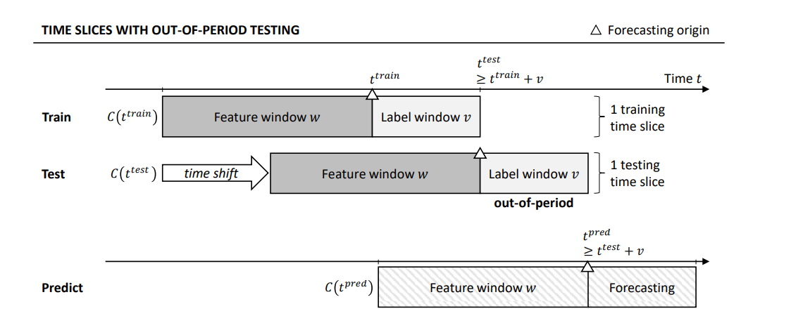

# Churn-Prediction
Abu Patel
 # Data Science Internship - Churn Preditiction Using Multi Time Slicing Approach in B2B Setting 

 *Machine Learning, B2B, Time Slicing*
 
  This Churn Analysis aims to contribute to both the theoretical and empirical body of knowledge in the non-contractual B2B customer churn prediction domain. In particular, we explore: 
  - Whether it is possible to use a single common source of business data (i.e., invoice data) to devise predictive models capable of reliably identifying churners in real-world settings, 
  - The effects of using different amounts of historical data for devising features on the performance of resulting models
  - whether using alternative churn definitions could yield models that perform well enough to serve as foundations for discussing new potential retention activities.

Finally, by leveraging a recently proposed approach to training data set creation and comparing it with the approach used traditionally, we aim to evaluate whether it generalizes to different case data.

# Churn Definition:

 Churn can be defined in multiple ways however the first step is the timeline to consider. Let’s say one is interested in predicting quarterly churn then churn at a customer level can be defined as customers who did not make any purchase in this quarter but did in previous quarter. Then this customer can be addressed with a value of 1(Churn) otherwise 0 or non-churn. Similarly, one can define churn yearly, monthly and at times even weekly depending on business needs. Our model is capable of handling churn at any time level, and this is only one of its robust capabilities

# Multiple Time Slicing Technique:
This is really the heart of the project:

 
 
 

 ## Advantages of Time Slicing 

 - It is robust enough to account for existing seasonality
 - The multislice model is neither an over sample nor an under-sample approach when it comes to imbalanced response distribution. Because of multiple training slices the model simply represent the data for what it is and ultimately tackles the class imbalance issue
 - Instead of out of sample testing the multislice model considers out of period testing that is testing on a more recent time slice which is much more realistic than random sampling.
 - Increase the training size drastically. Depending on number of years of data at hand we have methodologies in place to determine the right number of training slices. This dramatically increase the training size leveraging as much data as possible
 - Missing Trend values are implicitly calculated by the model as the different training slices are a result from shift in time and therefore eliminates the need of explicitly calculating trends

