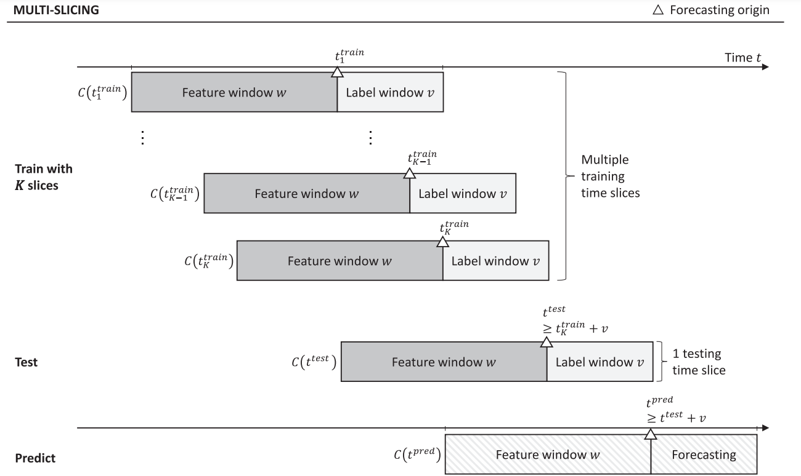
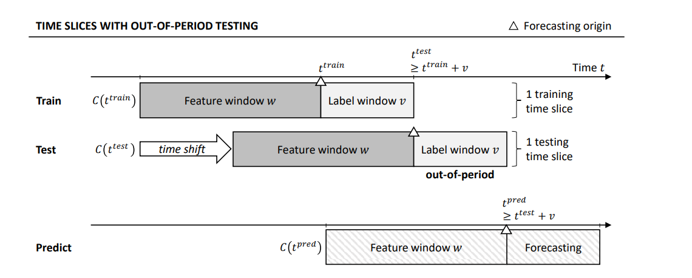
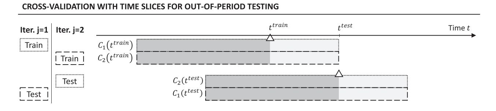
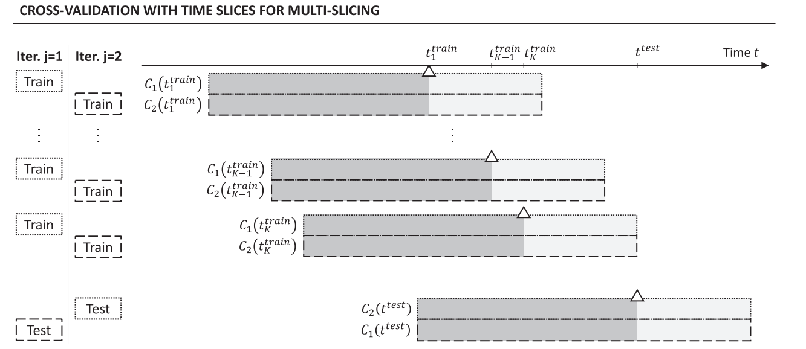
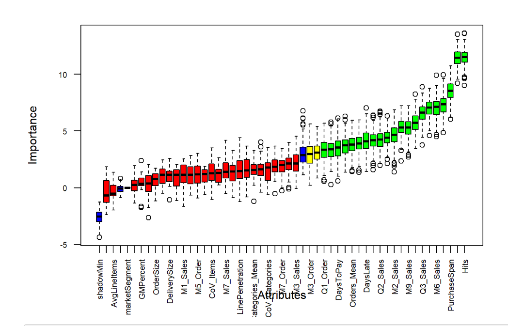
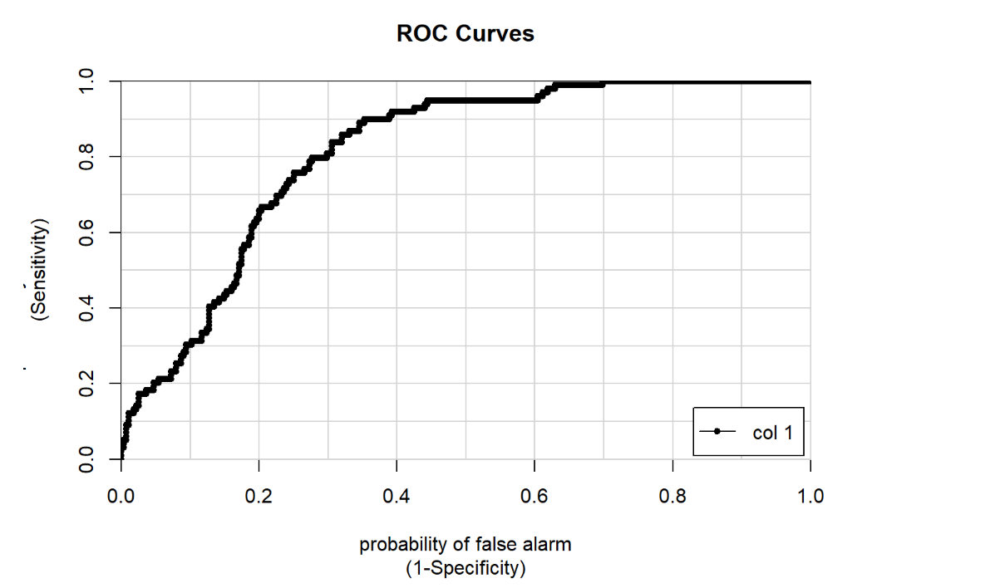
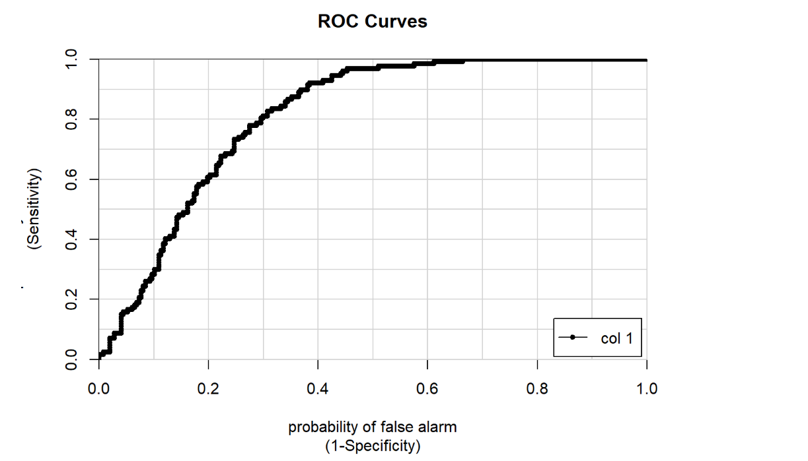
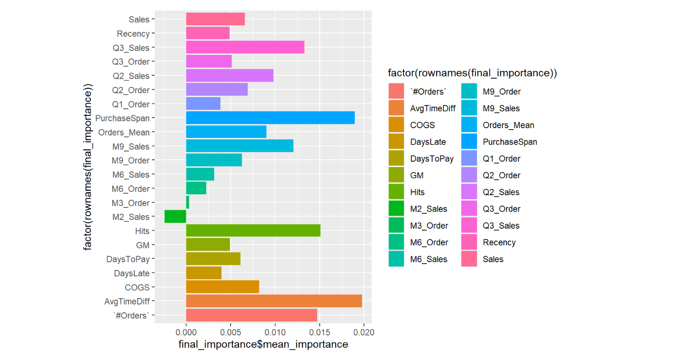
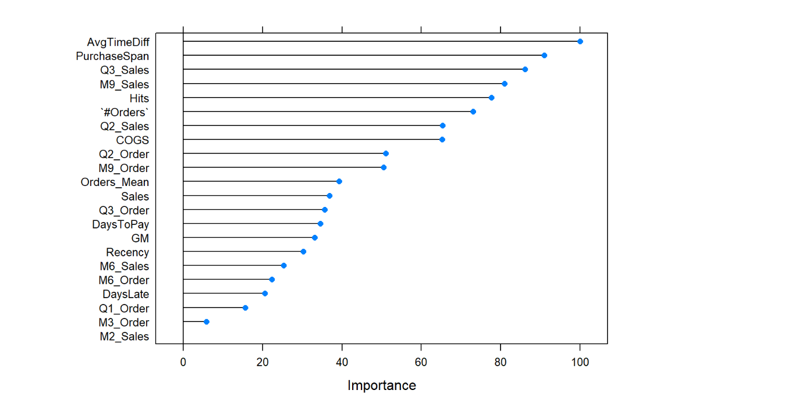
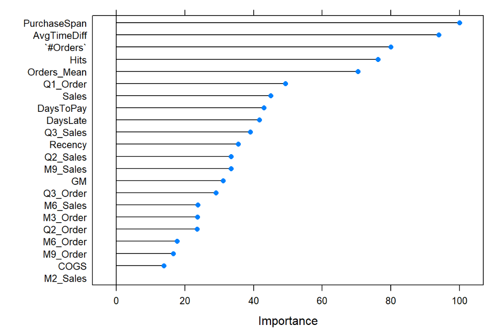

Churn Prediction - A new Scientific Approach
================
Abuzar Patel - Data Science Internship
2023-08-23

## Abstarct

*Machine Learning, B2B, Time Slicing* Our Churn Analysis aims to
contribute to both the theoretical and empirical body of knowledge in
the non-contractual **B2B** customer churn prediction domain. In
particular, we explore: (i) whether it is possible to use a single
common source of business data (i.e., invoice data) to devise predictive
models capable of reliably identifying churners in real-world settings,
(ii) the effects of using different amounts of historical data for
devising features on the performance of resulting models, and (iii)
whether using alternative churn definitions could yield models that
perform well enough to serve as foundations for discussing new potential
retention activities.

Finally, by leveraging a recently proposed approach to training data set
creation and comparing it with the approach used traditionally, we aim
to evaluate whether it generalizes to different case data.

## Churn Definition:

Churn Definition: Churn can be defined in multiple ways however the
first step is the **timeline** to consider. Let’s say one is interested
in predicting quarterly churn then churn at a customer level can be
defined as customers who did not make any purchase in this quarter but
did in previous quarter. Then this customer can be addressed with a
value of 1(Churn) otherwise 0 or non-churn. Similarly, one can define
churn yearly, monthly and at times even weekly depending on business
needs. Our model is capable of handling churn at any time level, and
this is only one of its robust capabilities :

## What sets this model so apart from traditional models?:

Customer churn prediction models using machine learning classification
have been developed predominantly by training and testing on one time
slice of data. We train models on multiple time slices of data and refer
to this approach as **multi-slicing**. Our results show that given the
same time frame of data, multi-slicing significantly improves churn
prediction performance compared to training on the entire data set as
one time slice. We demonstrate that besides an increased training set
size, the improvement is driven by training on samples from different
time slices. We confidently show that multi-slicing addresses the rarity
of churn samples and the risk of over fitting to the distinctive
situation in a single training time slice. Multi-slicing makes a model
more generalization, which is particularly relevant whenever conditions
change or fluctuate over time. Please contact me to discuss how to
choose the number of time slices. This approach is robust, addresses
seasonality in purchasing pattern, handles missing trend values, focuses
on out of period testing rather than traditional out of sample testing
and from an imbalance response(churn) distribution modelling standpoint
this approach is neither an oversample nor under sample or cost
sensitive learning, instead we represent the data for what it is, with
each time slice as most recent time to ensure our approach is as close
to reality as possible, thereby reducing overfitting. Moreover, as time
increases so does the number of training slices which would result in
better model performance by leveraging each observation to predict
Churn. In order to maintain no data leakage between multiple training
slices and test set we have developed a methodology that uses 2X5 nested
cross validation where the inner loop tunes the hyper parameter along
with a wrapper method for feature selection and the outer loop delivers
performance metrics on the whole set. Personally, an achievement that we
are very proud of is that only by using invoice data mainly we can come
up with a set of 52 feature space that can be applied to literally any
distributor and when integrated with the power of multi-slice approach
and statistically sound machine learning techniques we can significantly
bridge the gap between current limitations in non-contractual B2B
setting.

## Time Slicing Technique -



-----------------------------------------------------------------------------------------------------


**Advantages of MultiSlice Technique:**

-   It is robust enough to account for existing seasonality

-   The multislice model is neither an over sample nor an under-sample
    approach when it comes to imbalanced response distribution. Because
    of multiple training slices the model simply represent the data for
    what it is and ultimately tackles the class imbalance issue

-   Instead of out of sample testing the multislice model considers out
    of period testing that is testing on a more recent time slice which
    is much more realistic than random sampling.

-   Increase the training size drastically. Depending on number of years
    of data at hand we have methodologies in place to determine the
    right number of training slices. This dramatically increase the
    training size leveraging as much data as possible

-   Missing Trend values are implicitly calculated by the model as the
    different training slices are a result from shift in time and
    therefore eliminates the need of explicitly calculating trends

## Feature Space

Reading from my excel file: Please note the data is given in the github
and can be accessed accordingly

``` r
f<-"C:\\Users\\patel\\OneDrive\\Desktop\\ValleySolventsChurnDataMultiSlice_feat.xlsx"
library(readxl) #package to read from excel
library(dplyr)  #package for data manipulation 
```

    ## 
    ## Attaching package: 'dplyr'

    ## The following objects are masked from 'package:stats':
    ## 
    ##     filter, lag

    ## The following objects are masked from 'package:base':
    ## 
    ##     intersect, setdiff, setequal, union

``` r
data<- read_excel(f,na="TRUE") #reading file from excel
names(data) #checking column names
```

    ##  [1] "customerID"      "marketSegment"   "locationName"    "Sales"          
    ##  [5] "COGS"            "#Items"          "DaysToPay"       "#Categories"    
    ##  [9] "GM"              "LinePenetration" "GMPercent"       "Hits"           
    ## [13] "AvgLineItems"    "DeliverySize"    "OrderSize"       "Recency"        
    ## [17] "PurchaseSpan"    "AvgTimeDiff"     "Orders_Mean"     "Sales_Mean"     
    ## [21] "Items_Mean"      "Categories_Mean" "CoV_Orders"      "CoV_Sales"      
    ## [25] "CoV_Items"       "CoV_Categories"  "M3_Sales"        "M3_Order"       
    ## [29] "M7_Sales"        "M7_Order"        "M2_Sales"        "M2_Order"       
    ## [33] "M1_Sales"        "M1_Order"        "M4_Sales"        "M4_Order"       
    ## [37] "M6_Sales"        "M6_Order"        "M8_Sales"        "M8_Order"       
    ## [41] "M5_Sales"        "M5_Order"        "M9_Sales"        "M9_Order"       
    ## [45] "Q1_Sales"        "Q3_Sales"        "Q2_Sales"        "Q1_Order"       
    ## [49] "Q3_Order"        "Q2_Order"        "#Orders"         "DaysLate"       
    ## [53] "Churn"           "SheetName"

``` r
dim(data) #checking dimension  how many rows and columns
```

    ## [1] 11879    54

Note: I am not going into detail of what the EDA was like, as I really
want to focus on the heart of the project which is an **innovative
transformation of data into a multi time slice approach**. I truly
believe EDA is something most people are familiar with and when and if
needed please feel free to run this code and expand upon this analysis.
Data can be found in my github rep–

## Response Variable:

our response variable in this case is the column “Churn”

``` r
tail(data$Churn) # 0 means nor churn and 1 means Churn
```

    ## [1] 0 1 1 1 1 1

## 2X5 NESTED CROSS VALIDATION MultiTime Slice Technique:

For statistically testing our results, we derive a technique for
conducting cross-validation with out-of-period testing while using
multiple time slices within the training set. We consider two-fold
cross-validation. The technique entails partitioning the data set into
two equally sized subsets or folds which are each used once for testing.

In each iteration j of cross-validation, it is essential that the
subsets of customers used for training Cj(t^train) and testing
Cj(t^train) are not overlapping. It is not straightforward how to ensure
this when applying out-of-period testing since different observations of
the same customers can appear in both training and testing time slice.



We illustrate our approach for two-fold cross-validation in Fig above and below.

The goal is to use each observation only once for testing, either in
iteration 1 or in iteration 2 and to never train on customers that are
also used for testing in the same iteration. The testing slice customers
are assigned to two equally sized disjoint testing folds C1(t^test) and
C2(t^test). The training slice customers are also divided into subsets,
ensuring that customers used for testing in the same iteration are not
included in the corresponding training subset. Customers in C1(t^test)
that also appear in the (older) training slice are assigned to the
opposite fold for training C2(t^train) and vice versa. Customers that
only appear in the training slice are randomly assigned to the two
folds. In the first iteration, a model is trained on C1(t^train) and
tested on C1(t^test) and in the second iteration, it is trained on
C2(t^train) and tested on C2(t^test). The subset of customers trained on
and the subset of customers tested on are disjoint in each iteration:
C1(t^train) ∩ C1(t^test) = ∅ and C2(t^train) ∩ C2(t^test) = ∅.

We extend this to multi-slicing so that for each customer included in a
testing fold, all previous observations of the customer are excluded
from the corresponding training fold (see Fig. 4). Customers that only
appear in the training set are randomly assigned to one of the two
training folds. The approach generates disjoint subsets of customers for
training and testing in each iteration:



## Data Processing and setting up the logic

-   Domain knowledge helps here, as for example in code below we need to
    eliminate every observations that only had one single hit. Hit is a
    variable - which means how many times did the customer order in the
    past 9 months of training data. If customer has ordered only once,
    makes sense to remove that customer,

``` r
data[which(is.na(data$Hits)),"Hits"]=0   #Checking if hits is 0 or not and if yes what are the indices

#remove single hit customers
data <- data[-which(data$Hits<=1),]
dim(data) #checking dimensions again, 
```

    ## [1] 8596   54

-   Selecting training set from original data set. In the pre processing
    phase, I came up with this 54 variables from scratch and added
    column (variable) called sheet name, which gives direction to
    training and testing selection.

``` r
# now selecting only the training set without the testing from the original data set. 
train_data<-data %>%
  filter(SheetName != "Test")

dim(train_data) # always checking dimensions to ensure number of column is preserved
```

    ## [1] 7848   54

-   Handling Missing values from train and test:
-   Reasonable assumption below as we don’t have much missing data.

``` r
#seeing what are the mean values for column that have missing data, The means are without the missing data. (We use these values and some additional logic to replace missing data) 
na_col_train<-colnames(train_data)[colSums(is.na(train_data))>0]
na_col_train # these column have missing data
```

    ## [1] "GMPercent"   "AvgTimeDiff" "CoV_Sales"

``` r
grps<- train_data%>%
  group_by(Churn)%>%
  summarize(Gm=mean(GMPercent,na.rm=T),Time=mean(AvgTimeDiff,na.rm=T),CV=mean(CoV_Sales,na.rm=T))
```

-   Selecting Testing data (similar to training)

``` r
test<- data%>%
  filter(SheetName=="Test")
dim(test) #checking dimension of testing data
```

    ## [1] 748  54

``` r
#checking na column in entire data 
na_col<-colnames(test)[colSums(is.na(test))>0]
na_col
```

    ## [1] "GMPercent"   "AvgTimeDiff" "CoV_Sales"

``` r
#replacing the NA values without changing the order in the test data. similar to training. or you can eliminate the missing data, it yields very similar result

test[which(is.na(test$Hits<=2 & test$AvgTimeDiff)),"AvgTimeDiff"] = grps$Time[2] 
test[which(is.na(test$Hits<=2 &  test$CoV_Sales)),"CoV_Sales"] = grps$CV[2]
test[which(is.na(test$Hits == 2 & test$GMPercent)),"GMPercent"] = grps$Gm[2]
test[which(is.na(test$Hits!=2 & test$AvgTimeDiff)),"AvgTimeDiff"] = grps$Time[1]
test[which(is.na(test$Hits!=2 &  test$CoV_Sales)),"CoV_Sales"] = grps$CV[1]
test[which(is.na(test$GMPercent != 2 & test$GMPercent)),"GMPercent"] = grps$Gm[1]

#checking if test still contains na or not.... should not contain NA anymore
na_col<-colnames(test)[colSums(is.na(test))>0]
#confirmed 
na_col
```

    ## character(0)

-   CARET library for model building:

``` r
library(caret) # caret library for preprocessing, model building, confusion matrix
```

    ## Loading required package: ggplot2

    ## Loading required package: lattice

-   Dividing Test data into two disjoint sets, preparing for cross
    validation

``` r
#dividing the test set into two equally disjoint sets. We don't need to shuffle the data because objective is to test on a more recent time 

#before dividing checking if any of the customer ID will overlap in any of the future test fold(see code below this). 
#we don't want the customer ID to exist multiple time in the two testing set because we need to test each customer once and only once !!!


# logic, if number of observation is even then just half of the total number of obs else if odd then round 
if (dim(test)[1] %% 2 == 0) {
  l<- dim(test)[1]/2
}else {
  l<- round(0.5*dim(test)[1])
}
l # number of row where splitting will happen 
```

    ## [1] 374

``` r
nrow(test) #total number of row
```

    ## [1] 748

``` r
# testing_folds$Fold1
intersect(test[1:l,]$customerID,test[l+1:nrow(test),]$customerID) # confirming if disjoint or not 
```

    ## character(0)

``` r
test_fold1<-test[1:l,] #creating test fold 1 
test_fold2<-test[(l+1):nrow(test),] #creating test fold 2 
#this proves that customerID exist only once in each of the testing folds
#this proves that customers are disjoint in both folds
intersect(test_fold1$customerID,test_fold2$customerID)
```

    ## character(0)

-   Now, we will process Training Data and prepare it for a 2X5 Nested
    Cross Validation Technique:

``` r
#now we have train data to consider

names(train_data)
```

    ##  [1] "customerID"      "marketSegment"   "locationName"    "Sales"          
    ##  [5] "COGS"            "#Items"          "DaysToPay"       "#Categories"    
    ##  [9] "GM"              "LinePenetration" "GMPercent"       "Hits"           
    ## [13] "AvgLineItems"    "DeliverySize"    "OrderSize"       "Recency"        
    ## [17] "PurchaseSpan"    "AvgTimeDiff"     "Orders_Mean"     "Sales_Mean"     
    ## [21] "Items_Mean"      "Categories_Mean" "CoV_Orders"      "CoV_Sales"      
    ## [25] "CoV_Items"       "CoV_Categories"  "M3_Sales"        "M3_Order"       
    ## [29] "M7_Sales"        "M7_Order"        "M2_Sales"        "M2_Order"       
    ## [33] "M1_Sales"        "M1_Order"        "M4_Sales"        "M4_Order"       
    ## [37] "M6_Sales"        "M6_Order"        "M8_Sales"        "M8_Order"       
    ## [41] "M5_Sales"        "M5_Order"        "M9_Sales"        "M9_Order"       
    ## [45] "Q1_Sales"        "Q3_Sales"        "Q2_Sales"        "Q1_Order"       
    ## [49] "Q3_Order"        "Q2_Order"        "#Orders"         "DaysLate"       
    ## [53] "Churn"           "SheetName"

``` r
#to be sure checking which column in the training set has missing values and replace it based on the response value by grouping them, check line 80
na_train<- colnames(train_data)[colSums(is.na(train_data))>0]
na_train
```

    ## [1] "GMPercent"   "AvgTimeDiff" "CoV_Sales"

``` r
#replacing na values in training data 

train_data[which(is.na(train_data$Churn==0 & train_data$AvgTimeDiff)),"AvgTimeDiff"]= grps$Time[1]
train_data[which(is.na(train_data$Churn==0 & train_data$GMPercent)),"GMPercent"]= grps$Gm[1]
train_data[which(is.na(train_data$Churn==0 & train_data$CoV_Sales)),"CoV_Sales"]= grps$CV[1]
train_data[which(is.na(train_data$Churn==1 & train_data$AvgTimeDiff)),"AvgTimeDiff"]= grps$Time[2]
train_data[which(is.na(train_data$Churn==1 & train_data$GMPercent)),"GMPercent"]= grps$Gm[2]
train_data[which(is.na(train_data$Churn==1 & train_data$CoV_Sales)),"CoV_Sales"]= grps$CV[2]

#checking if na still exist in train data
# colnames(train_data)[colSums(is.na(train_data)>0)]
#NO NAS found ^^


#making index for those customers that are unique only in training data when compared to entire test data 
only_train_index<-which(train_data$customerID %in% test$customerID=="FALSE")
#making  separate data set for those customers that exist only in training data 
C<-train_data[only_train_index,]
#deleting those customers from original data frame to make sure we are not duplicating customers
train_data<-train_data[-only_train_index,]
```

-   Randomly splitting training set into two different training sets

``` r
#randomly sampling those customers that are only present in train into either of the two training folds
set.seed(111)
index<-sample(1:nrow(C),size=round(0.5*nrow(C)),replace=F)
#C1_train is training fold 1
C1_train<- C[index,]
#training fold 2
C2_train<- C[-index,]
# dim(C1_train)
# dim(C2_train)
# dim(train_data)

#two random folds are created
# train_data[train_data$customerID %in% C$customerID=="TRUE",]
# r1<-which(train_data$customerID %in% C$customerID=="TRUE")
# train_data<- train_data[-r1,]

#checking intersection

# train_data$customerID %in% C$customerID -- No common found as expected


#removed customers from original train data as already placed them in two folds
# train_data[train_data$customerID %in% C$customerID=="TRUE",]
# #customers that are in training data but not in C because we need to remove these customers from original set
# dim(train_data)


#now checking the remaining customers in original training data with test fold 1

which(train_data$customerID %in% test_fold1$customerID=="TRUE")
```

    ##    [1]    1    2    3    4    5    6    7    8    9   10   12   13   14   15
    ##   [15]   16   17   18   19   20   22   23   24   25   26   27   28   29   30
    ##   [29]   31   32   33   34   35   38   39   40   41   42   43   44   45   46
    ##   [43]   48   49   50   51   52   53   61   65   66   67   68   70   71   72
    ##   [57]   73   74   75   79   80   81   82   83   84   85   86   87   88   89
    ##   [71]   91   92   93   94   95   96   97   99  100  101  102  103  105  106
    ##   [85]  107  108  109  110  111  112  113  114  115  116  117  118  119  120
    ##   [99]  121  122  123  124  125  126  127  128  129  131  132  133  142  144
    ##  [113]  146  147  148  149  150  151  152  153  154  155  159  160  161  162
    ##  [127]  163  164  165  166  168  169  170  171  172  173  174  175  176  177
    ##  [141]  178  180  181  182  183  184  185  186  187  189  190  191  192  193
    ##  [155]  194  195  196  197  198  199  200  201  202  203  204  205  206  207
    ##  [169]  209  210  211  212  213  214  215  216  217  218  220  221  222  223
    ##  [183]  224  227  228  230  231  232  233  234  235  236  237  238  239  241
    ##  [197]  242  243  244  245  246  247  248  250  251  252  253  254  255  256
    ##  [211]  258  259  260  261  262  263  264  265  266  267  268  273  274  276
    ##  [225]  277  278  279  280  281  285  286  288  289  290  291  292  293  294
    ##  [239]  297  300  302  303  304  305  307  308  309  310  312  314  315  316
    ##  [253]  317  318  319  320  321  322  323  324  325  326  327  328  329  330
    ##  [267]  331  332  333  334  335  336  337  338  339  340  341  342  343  344
    ##  [281]  345  346  347  349  352  353  354  355  356  359  360  361  362  365
    ##  [295]  366  367  369  370  371  372  373  374  375  376  378  379  380  381
    ##  [309]  382  383  384  385  387  388  389  390  391  392  393  394  395  396
    ##  [323]  397  398  399  406  407  408  409  410  411  412  413  414  415  416
    ##  [337]  417  418  420  421  422  423  424  425  426  428  429  430  431  433
    ##  [351]  434  435  436  437  438  439  440  441  442  443  444  445  446  447
    ##  [365]  448  449  450  451  452  453  454  455  456  457  458  459  460  463
    ##  [379]  464  465  466  467  468  469  470  471  472  473  474  475  476  477
    ##  [393]  478  479  481  482  483  484  485  487  488  490  491  493  494  495
    ##  [407]  496  497  498  499  500  501  502  503  504  505  506  507  508  509
    ##  [421]  510  511  512  513  514  515  518  519  520  521  522  523  524  525
    ##  [435]  526  527  528  530  531  532  533  534  535  536  537  538  539  540
    ##  [449]  541  545  546  547  548  549  550  551  552  553  554  555  556  557
    ##  [463]  558  559  560  561  562  563  564  565  568  569  570  571  572  574
    ##  [477]  575  576  577  578  579  580  581  582  583  584  585  586  587  588
    ##  [491]  590  592  593  594  595  596  597  598  599  600  601  602  605  606
    ##  [505]  607  608  609  610  611  612  613  614  616  617  618  619  620  621
    ##  [519]  622  623  624  625  626  627  628  629  630  631  632  633  634  635
    ##  [533]  636  637  638  639  640  641  642  643  644  645  646  648  649  650
    ##  [547]  651  653  654  655  656  657  658  659  660  661  662  663  664  665
    ##  [561]  666  667  668  671  673  675  676  677  678  679  680  681  682  683
    ##  [575]  684  685  686  687  688  689  690  691  692  693  694  695  696  697
    ##  [589]  698  699  700  701  702  703  705  706  707  708  709  710  711  712
    ##  [603]  713  714  715  716  717  722  723  724  726  728  729  731  732  733
    ##  [617]  737  740  741  743  744  745  747  750  751  752  753  755  756  757
    ##  [631]  758  759  760  761  762  763  764  766  767  770  771  772  773  774
    ##  [645]  775  776  777  778  780  782  783  784  785  786  788  789  790  791
    ##  [659]  792  793  794  795  796  800  801  802  804  805  806  807  808  809
    ##  [673]  810  813  815  816  817  818  819  820  821  822  823  825  826  827
    ##  [687]  828  830  832  833  836  837  840  841  842  845  846  847  848  849
    ##  [701]  850  851  852  853  854  855  856  857  858  859  860  861  862  868
    ##  [715]  871  872  874  879  880  883  886  887  888  889  890  891  892  893
    ##  [729]  894  897  898  899  900  901  902  903  904  905  906  907  909  910
    ##  [743]  912  913  914  915  916  917  918  919  920  921  922  923  924  925
    ##  [757]  926  927  928  929  931  932  933  934  935  936  937  938  939  940
    ##  [771]  941  942  943  949  950  951  952  953  954  957  958  959  960  963
    ##  [785]  964  965  966  970  971  972  973  974  975  976  978  979  980  981
    ##  [799]  982  983  984  985  986  987  988  989  990  992  993  994  995  996
    ##  [813]  997  998 1000 1001 1002 1003 1004 1005 1006 1007 1008 1009 1010 1011
    ##  [827] 1012 1013 1015 1016 1017 1018 1020 1021 1022 1023 1025 1028 1029 1030
    ##  [841] 1031 1032 1033 1034 1035 1036 1037 1038 1039 1040 1041 1042 1043 1045
    ##  [855] 1046 1047 1048 1049 1050 1052 1053 1054 1055 1056 1057 1058 1059 1060
    ##  [869] 1061 1062 1063 1064 1065 1066 1067 1068 1069 1070 1071 1073 1074 1075
    ##  [883] 1076 1077 1079 1080 1081 1082 1083 1084 1085 1086 1087 1088 1089 1090
    ##  [897] 1091 1092 1093 1096 1097 1098 1099 1100 1101 1103 1104 1105 1106 1107
    ##  [911] 1108 1109 1110 1111 1112 1114 1115 1116 1117 1118 1119 1120 1121 1122
    ##  [925] 1123 1124 1125 1126 1127 1128 1129 1130 1131 1134 1135 1136 1137 1138
    ##  [939] 1140 1141 1142 1143 1144 1145 1146 1147 1148 1149 1150 1151 1152 1153
    ##  [953] 1158 1160 1161 1162 1163 1166 1168 1169 1170 1171 1172 1173 1174 1175
    ##  [967] 1176 1177 1181 1183 1184 1186 1187 1191 1195 1196 1197 1199 1201 1202
    ##  [981] 1203 1204 1205 1206 1207 1208 1209 1210 1211 1212 1213 1214 1215 1216
    ##  [995] 1217 1218 1219 1220 1221 1222 1223 1224 1225 1227 1229 1230 1231 1232
    ## [1009] 1236 1237 1238 1241 1242 1243 1244 1245 1246 1247 1248 1249 1250 1251
    ## [1023] 1252 1253 1254 1255 1257 1258 1259 1260 1261 1262 1263 1264 1265 1266
    ## [1037] 1267 1268 1269 1270 1271 1273 1274 1276 1278 1279 1280 1281 1282 1283
    ## [1051] 1284 1285 1286 1287 1288 1289 1290 1291 1293 1294 1295 1296 1298 1299
    ## [1065] 1300 1301 1302 1303 1304 1305 1306 1307 1308 1309 1310 1311 1313 1314
    ## [1079] 1315 1316 1317 1319 1320 1321 1322 1323 1324 1325 1326 1327 1330 1331
    ## [1093] 1332 1333 1334 1335 1336 1337 1338 1339 1340 1341 1342 1343 1344 1345
    ## [1107] 1346 1347 1349 1350 1351 1352 1353 1354 1355 1356 1357 1358 1359 1360
    ## [1121] 1361 1362 1363 1364 1365 1366 1367 1368 1370 1371 1372 1373 1374 1377
    ## [1135] 1378 1379 1380 1381 1382 1383 1384 1385 1387 1388 1389 1390 1391 1392
    ## [1149] 1393 1395 1396 1397 1398 1399 1400 1402 1403 1404 1405 1406 1407 1408
    ## [1163] 1409 1411 1412 1413 1414 1415 1416 1418 1419 1420 1421 1422 1423 1424
    ## [1177] 1425 1426 1427 1429 1430 1431 1432 1433 1436 1439 1440 1441 1442 1443
    ## [1191] 1451 1452 1453 1454 1455 1457 1458 1459 1462 1463 1465 1466 1467 1468
    ## [1205] 1469 1470 1471 1472 1474 1475 1476 1478 1479 1480 1483 1484 1486 1488
    ## [1219] 1489 1490 1492 1493 1494 1495 1496 1497 1498 1499 1500 1501 1502 1503
    ## [1233] 1504 1505 1506 1507 1508 1510 1511 1513 1515 1516 1517 1518 1519 1520
    ## [1247] 1523 1524 1527 1528 1529 1530 1531 1532 1533 1534 1535 1536 1537 1538
    ## [1261] 1539 1541 1542 1543 1544 1545 1546 1547 1548 1549 1550 1551 1553 1554
    ## [1275] 1555 1556 1557 1558 1559 1560 1563 1565 1566 1567 1568 1569 1570 1571
    ## [1289] 1572 1573 1574 1575 1576 1577 1578 1579 1580 1581 1582 1583 1584 1585
    ## [1303] 1586 1589 1590 1591 1592 1595 1596 1597 1599 1600 1601 1602 1603 1605
    ## [1317] 1607 1610 1612 1613 1614 1615 1616 1617 1618 1621 1622 1623 1624 1625
    ## [1331] 1626 1628 1629 1630 1631 1632 1633 1634 1635 1636 1637 1638 1639 1641
    ## [1345] 1642 1643 1646 1647 1648 1649 1650 1651 1652 1654 1655 1656 1657 1658
    ## [1359] 1659 1660 1662 1663 1664 1665 1666 1669 1670 1673 1674 1675 1676 1677
    ## [1373] 1678 1679 1680 1681 1682 1683 1684 1685 1686 1687 1688 1693 1694 1695
    ## [1387] 1696 1699 1700 1701 1702 1705 1706 1708 1709 1711 1712 1713 1714 1715
    ## [1401] 1716 1719 1720 1721 1722 1724 1727 1730 1733 1735 1736 1737 1738 1739
    ## [1415] 1740 1741 1742 1743 1744 1745 1749 1750 1751 1753 1754 1755 1756 1757
    ## [1429] 1758 1760 1761 1762 1764 1765 1766 1767 1768 1770 1771 1772 1773 1774
    ## [1443] 1775 1776 1779 1780 1781 1782 1783 1784 1785 1788 1790 1791 1792 1793
    ## [1457] 1794 1795 1796 1798 1805 1806 1807 1808 1810 1811 1812 1813 1814 1816
    ## [1471] 1817 1820 1821 1822 1823 1824 1825 1827 1828 1829 1830 1831 1832 1834
    ## [1485] 1835 1836 1839 1842 1843 1844 1845 1853 1854 1860 1861 1862 1863 1865
    ## [1499] 1867 1869 1870 1871 1873 1874 1875 1877 1879 1880 1881 1882 1884 1885
    ## [1513] 1886 1887 1888 1890 1891 1892 1896 1898 1899 1900 1905 1907 1908 1909
    ## [1527] 1910 1911 1916 1917 1918 1919 1920 1921 1922 1924 1925 1926 1927 1929
    ## [1541] 1931 1932 1933 1934 1935 1937 1939 1940 1941 1945 1946 1947 1949 1950
    ## [1555] 1951 1952 1953 1954 1955 1956 1957 1958 1959 1960 1961 1962 1963 1964
    ## [1569] 1965 1966 1967 1972 1973 1976 1977 1978 1980 1981 1984 1985 1988 1989
    ## [1583] 1990 1991 1992 1993 1994 1996 1997 1998 2000 2001 2002 2006 2007 2008
    ## [1597] 2012 2013 2014 2015 2016 2022 2023 2024 2025 2026 2027 2028 2030 2031
    ## [1611] 2032 2033 2034 2036 2037 2038 2042 2043 2044 2045 2046 2047 2048 2049
    ## [1625] 2050 2051 2052 2053 2054 2055 2056 2058 2059 2060 2061 2062 2064 2065
    ## [1639] 2066 2067 2068 2069 2070 2071 2072 2073 2075 2077 2078 2079 2081 2082
    ## [1653] 2083 2084 2085 2088 2089 2090 2091 2092 2093 2094 2095 2096 2097 2098
    ## [1667] 2101 2102 2103 2104 2105 2106 2107 2108 2109 2110 2111 2113 2116 2117
    ## [1681] 2118 2119 2120 2123 2127 2128 2130 2131 2132 2133 2134 2137 2138 2139
    ## [1695] 2140 2141 2143 2144 2148 2149 2150 2152 2153 2154 2156 2157 2158 2159
    ## [1709] 2160 2161 2162 2164 2166 2167 2169 2170 2172 2173 2174 2175 2176 2177
    ## [1723] 2179 2180 2181 2182 2183 2187 2188 2189 2190 2191 2193 2197 2198 2200
    ## [1737] 2205 2206 2207 2208 2211 2214 2215 2217 2218 2220 2221 2223 2224 2225
    ## [1751] 2226 2227 2228 2229 2230 2231 2232 2238 2239 2240 2241 2242 2243 2245
    ## [1765] 2246 2247 2248 2249 2250 2251 2252 2254 2257 2258 2259 2260 2261 2262
    ## [1779] 2263 2265 2267 2268 2271 2272 2273 2274 2275 2276 2277 2279 2280 2281
    ## [1793] 2282 2283 2284 2285 2286 2287 2289 2290 2291 2294 2295 2296 2302 2303
    ## [1807] 2304 2307 2311 2314 2315 2316 2317 2318 2319 2321 2322 2323 2324 2326
    ## [1821] 2327 2328 2329 2330 2332 2333 2334 2335 2336 2337 2338 2339 2340 2341
    ## [1835] 2343 2344 2345 2346 2347 2348 2351 2352 2359 2360 2362 2363 2365 2368
    ## [1849] 2369 2372 2375 2377 2378 2380 2382 2383 2384 2385 2386 2387 2388 2389
    ## [1863] 2391 2393 2394 2395 2396 2397 2399 2400 2401 2402 2403 2404 2405 2406
    ## [1877] 2407 2408 2409 2412 2413 2414 2415 2416 2418 2419 2420 2422 2423 2424
    ## [1891] 2426 2427 2429 2430 2431 2432 2433 2434 2440 2441 2443 2444 2446 2449
    ## [1905] 2450 2451 2452 2454 2458 2459 2460 2461 2466 2467 2468 2469 2471 2473
    ## [1919] 2474 2475 2476 2477 2482 2483 2484 2485 2486 2488 2489 2490 2491 2492
    ## [1933] 2494 2495 2496 2500 2502 2508 2510 2511 2515 2516 2517 2518 2519 2520
    ## [1947] 2521 2522 2523 2524 2525 2528 2529 2530 2532 2533 2537 2538 2541 2542
    ## [1961] 2543 2548 2551 2552 2553 2555 2557 2558 2559 2561 2562 2563 2568 2569
    ## [1975] 2572 2573 2574 2575 2578 2579 2582 2583 2584 2585 2587 2588 2592 2593
    ## [1989] 2594 2595 2596 2597 2599 2600 2606 2607 2608 2612 2613 2614 2615 2616
    ## [2003] 2617 2618 2619 2620 2621 2622 2625 2626 2628 2629 2630 2636 2637 2638
    ## [2017] 2639 2640 2645 2646 2647 2648 2649 2650 2651 2652 2653 2657 2659 2660
    ## [2031] 2661 2662 2663 2664 2665 2666 2667 2668 2669 2674 2676 2677 2680 2682
    ## [2045] 2684 2685 2686 2687 2688 2689 2690 2691 2692 2694 2695 2696 2697 2698
    ## [2059] 2699 2701 2702 2703 2704 2709 2710 2711 2714 2715 2716 2717 2719 2720
    ## [2073] 2721 2722 2723 2724 2725 2726 2730 2731 2733 2734 2735 2736 2737 2740
    ## [2087] 2744 2752 2758 2759 2760 2761 2762 2763 2764 2765 2766 2767 2768 2769
    ## [2101] 2771 2776 2779 2780 2781 2789 2791 2792 2794 2795 2798 2802 2803 2804
    ## [2115] 2805 2806 2807 2823 2824 2826 2828 2829 2830 2833 2834 2835 2836 2837
    ## [2129] 2839 2840 2849 2851 2852 2855 2856 2859 2861 2866 2867 2868 2870 2872
    ## [2143] 2873 2874 2876 2877 2878 2879 2880 2882 2883 2884 2885 2886 2888 2889
    ## [2157] 2891 2892 2893 2898 2900 2901 2906 2907 2908 2909 2910 2911 2912 2913
    ## [2171] 2914 2916 2920 2921 2923 2926 2929 2930 2934 2935 2936 2937 2938 2939
    ## [2185] 2940 2941 2943 2945 2947 2948 2949 2953 2954 2956 2962 2964 2966 2967
    ## [2199] 2969 2970 2971 2973 2974 2975 2977 2978 2979 2983 2984 2985 2988 2993
    ## [2213] 2994 2998 2999 3003 3005 3006 3008 3009 3010 3011 3012 3013 3015 3017
    ## [2227] 3021 3026 3027 3028 3029 3030 3031 3032 3033 3035 3036 3039 3041 3042
    ## [2241] 3044 3045 3053 3054 3055 3056 3057 3060 3061 3063 3064 3065 3067 3069
    ## [2255] 3072 3074 3075 3076 3078 3081 3082 3083 3087 3095 3098 3099 3100 3102
    ## [2269] 3104 3111 3116 3117 3119 3121 3123 3125 3127 3129 3136 3138 3139 3140
    ## [2283] 3142 3143 3145 3147 3148 3152 3154 3155 3156 3157 3158 3159 3165 3166
    ## [2297] 3167 3168 3170 3171 3172 3174 3178 3180 3181 3182 3185 3186 3190 3191
    ## [2311] 3193 3195 3197 3198 3206 3210 3211 3215 3217 3219 3220 3221 3222 3223
    ## [2325] 3224 3227 3228 3229 3230 3231 3232 3234 3235 3236 3237 3240 3244 3249
    ## [2339] 3250 3251 3254 3258 3259 3260 3268 3270 3271 3272 3273 3275 3276 3277
    ## [2353] 3278 3289 3294 3298 3299 3300 3301 3303 3304 3305 3307 3309 3314 3317
    ## [2367] 3323 3327 3335 3342 3346 3354 3355 3356 3357 3360 3361 3362 3365 3373
    ## [2381] 3375 3379 3380 3381 3391 3392 3398 3401 3402 3403 3404 3405 3411 3414
    ## [2395] 3419 3421 3422 3426 3428 3429 3432 3433 3434 3435 3436 3437 3441 3443
    ## [2409] 3444 3446 3447 3451 3452 3453 3457 3460 3461 3462 3463 3464 3465 3466
    ## [2423] 3469 3470 3471 3472 3473 3477 3480 3484 3485 3486 3487 3489 3493 3494
    ## [2437] 3495 3496 3497 3498 3499 3500 3502 3507 3508 3511 3512 3516 3517 3518
    ## [2451] 3520 3522 3531 3532 3535 3537 3538 3544 3545 3550 3556 3558 3561 3562
    ## [2465] 3563 3565 3568 3570 3577 3578 3585 3586 3590 3593 3595 3596 3597 3598
    ## [2479] 3602 3603 3604 3605 3606 3607 3608 3610 3611 3612 3615 3616 3617 3623
    ## [2493] 3624 3625 3633 3635 3641 3643 3645 3651 3654 3659 3660 3661 3662 3664
    ## [2507] 3665 3667 3668 3673 3674 3680 3681 3685 3686 3687 3689 3692 3693 3701
    ## [2521] 3705 3706 3708 3709 3711 3712 3713 3714 3718 3723 3727 3732 3736 3739
    ## [2535] 3744 3745 3746 3747 3751 3752 3753 3759 3763 3764 3768 3780 3782 3785
    ## [2549] 3786 3789 3790 3796 3797 3798 3799 3800 3801 3802 3803 3804 3811 3818
    ## [2563] 3820 3822 3832 3836 3839 3848 3859 3868 3870 3871 3872 3873 3879 3880
    ## [2577] 3881 3893 3894 3896 3897 3904 3905 3907 3913 3917 3919 3924 3930 3944
    ## [2591] 3945 3947 3948 3950 3951 3952 3958 3960 3961 3962 3964 3977 3987 3992
    ## [2605] 3995 3997 3998 3999 4002 4003 4008 4009 4011 4014 4015 4016 4017 4022
    ## [2619] 4026 4027 4031 4032 4033 4041 4045 4046 4049 4054 4055 4056 4058 4061
    ## [2633] 4062 4063 4064 4067 4069 4070 4071 4076 4078 4079 4081 4084 4086 4087
    ## [2647] 4088 4097 4100 4101 4102 4105 4107 4109 4113 4114 4116 4117 4119 4120
    ## [2661] 4121 4122 4125 4129 4130 4131 4142 4143 4144 4146 4148 4149 4150 4152
    ## [2675] 4154 4159 4161 4163 4164 4165 4171 4172 4174 4178 4179 4181 4182 4183
    ## [2689] 4191 4194 4196 4204 4214 4218 4219 4220 4221 4222 4223 4224 4235 4238
    ## [2703] 4253 4254 4256 4259 4260 4262 4264 4269 4271 4275 4276 4277 4283 4284
    ## [2717] 4290 4292 4293 4299 4301 4303 4304 4305 4310 4316 4318 4319 4321 4322
    ## [2731] 4331 4332 4333 4334 4336 4346 4350 4351 4358 4359 4360 4365 4366 4368
    ## [2745] 4370 4371 4373 4384 4389 4390 4391 4392 4393 4394 4397 4405 4406 4414
    ## [2759] 4417 4421 4424 4436 4452 4455 4460 4469 4471 4472 4474 4478 4483 4486
    ## [2773] 4487 4488 4491 4492 4493 4504 4505 4507 4508 4509 4510 4511 4513 4529
    ## [2787] 4538 4539 4540 4548 4558 4560 4562 4576 4580 4606 4610 4619 4620 4621
    ## [2801] 4622 4630 4634 4635 4641 4653 4670 4671 4673 4678 4682 4683 4685 4686
    ## [2815] 4687 4688 4693 4696 4708 4736 4737 4749 4756 4758 4771 4775 4778 4797
    ## [2829] 4805 4811 4817 4822 4827 4828 4829 4830 4831 4832 4833 4834 4835 4837
    ## [2843] 4843 4845 4892 4897 4898 4904 4905 4906 4907 4923 4926 4939 4946 4947
    ## [2857] 4956 4971 4972 4991 4992 4993 4994 4995 4996 4997 4998 5002 5024 5028
    ## [2871] 5030 5037 5038 5042 5043 5044 5045 5046 5050 5052 5078 5079 5080 5088
    ## [2885] 5096 5104 5105 5117 5133 5140 5141 5142 5143 5159 5166 5178 5179 5180
    ## [2899] 5182 5183 5184 5185 5186 5187 5188 5193 5194 5201 5207 5208 5209 5210
    ## [2913] 5214 5218 5219 5220 5221 5234 5235 5246 5247 5248 5253 5260 5261 5264
    ## [2927] 5265 5267 5269 5270 5283 5284 5285 5297 5298 5319 5320 5325 5326 5327
    ## [2941] 5328 5335 5340 5348 5349 5350 5361 5362 5363 5369 5370 5406 5408 5418
    ## [2955] 5419 5423 5439 5440 5448 5449 5450 5484 5485 5490 5500 5501 5504 5506
    ## [2969] 5507 5508 5510 5511 5516 5522 5524 5525 5526 5527 5528 5551 5552 5553
    ## [2983] 5554 5555 5567 5568 5572 5573 5575 5576 5580 5589 5593 5596 5597 5598
    ## [2997] 5612 5635 5653 5654 5655 5656 5657 5658 5659 5666 5671 5672 5683 5684
    ## [3011] 5685 5686 5691 5692 5704 5706 5707 5715 5717 5719 5720 5723 5728 5731
    ## [3025] 5735 5739 5743 5745 5747 5750 5753 5754 5762 5764 5766 5767 5771 5775
    ## [3039] 5778 5786 5787 5788 5789 5791 5792 5796 5797 5802 5804 5805 5807 5810
    ## [3053] 5812 5819 5823 5824 5826 5827 5828 5830 5831 5832 5833 5835 5837 5838
    ## [3067] 5839 5840 5841 5842 5844 5854 5855 5856 5857 5858 5859 5861 5862 5863
    ## [3081] 5864 5867 5872 5873 5874 5875 5876 5877 5878 5880 5881 5882 5884 5885
    ## [3095] 5886 5887 5896 5898 5899 5900 5901 5902 5905 5906 5907 5908 5919 5921
    ## [3109] 5922 5926 5929 5931 5933 5934 5946 5948 5951 5952 5953 5956 5957 5959
    ## [3123] 5963 5967 5969 5971 5986 5994 5995 5996 6002 6006 6008 6011 6035 6036
    ## [3137] 6039 6041 6043 6045 6047 6049 6051 6054 6057 6060

``` r
#seeing which customers in test fold 1 also present in training data
to_fold2_train<-which(train_data$customerID %in% test_fold1$customerID=="TRUE")
#inputting the customers that are present in test 1 and training in fold 2 of training

C2_train<-rbind(train_data[to_fold2_train,],C2_train)
sum(C2_train$customerID %in% test_fold1$customerID)
```

    ## [1] 3146

``` r
sum(train_data[to_fold2_train,]$customerID %in% test_fold2$customerID)
```

    ## [1] 0

``` r
#deleting the training values which we just placed in C2_train from original train data
train_data<-train_data[-to_fold2_train,]
dim(train_data)
```

    ## [1] 2916   54

-repeating for test set 2

``` r
#repeating process for test set 2 now. objective is to find index of the customers that are overlapping between remaining training data and test set 2 and taking those customer indexes and placing them in fold 1 of training (C1_train)

# checking customers that exist in original train data and test2 now.
sum(train_data$customerID %in% test_fold2$customerID) #-- # should be 0 
```

    ## [1] 2916

``` r
#index of fold1
to_fold1_train<-which(train_data$customerID %in% test_fold2$customerID=="TRUE")


#binding
C1_train<- rbind(train_data[to_fold1_train,],C1_train)

#proof that Intersection of test fold 1 and Fold 1 train is 0
sum(C1_train$customerID %in% test_fold1$customerID)
```

    ## [1] 0

``` r
#proof that intersection of test fold 2 and train fold 2 are 0
sum(C2_train$customerID %in% test_fold2$customerID)
```

    ## [1] 0

``` r
train_data<-train_data[-to_fold1_train,]
dim(train_data) # must be zero--- this is a proof that we started with X number of observation in training and then eliminated those as we split them in to two different training ensure no over laps with testing data for cross validation purposes
```

    ## [1]  0 54

``` r
#that test fold 1 and fold 2 are disjoint set proof
sum(test_fold2$customerID %in% test_fold1$customerID)
```

    ## [1] 0

``` r
#hence proved. 
intersect(C1_train$customerID,test_fold1$customerID) #proof of no data leakage 
```

    ## character(0)

``` r
intersect(C2_train$customerID,test_fold2$customerID) # proof of no data leakage
```

    ## character(0)

``` r
# dim(C1_train)
# dim(C2_train)
```

## Summary of processing

-   in summary we developed a simple yet effective technique to ensure
    the following : – the customers in testing set are tested only once
    in each iteration (2) and therefore developed two disjoint sets of
    test fold1 and fold 2 – then we made sure that customers in training
    and test set are not overlapping in each iteration – for example
    iteration one will be over C1_train and test fold 1 with no
    overlapping customers – second iteration will be over C2_train and
    test fold 2 with no overlapping customers

ultimate goal of doing this was we need to test on **out of period
data** and not out of sample which in other words is very useful for
time series data. Need to test on most recent time while capturing and
training over as much data as we can **without any overlapping
customers**. we created two training set and two test sets to conduct a
nested 5X2 cross validation where the outer loop will be used for final
testing and calculating AUC Metric and inner loop to tune hyper
parameters

## Response Distribution check after processing:

– checking imbalance in both training and both testing data, might help
us to make a judgement in order to which weights to use during our
modelling.

``` r
prop.table(table(C1_train$Churn)) #proportion of Churn and non Churn in C1_train
```

    ## 
    ##         0         1 
    ## 0.6757679 0.3242321

``` r
table(C2_train$Churn)       
```

    ## 
    ##    0    1 
    ## 3018 1021

``` r
prop.table(table(C2_train$Churn)) # proportion of Churn and non Churn in C2_train
```

    ## 
    ##         0         1 
    ## 0.7472147 0.2527853

``` r
prop.table(table(test_fold1$Churn)) #proportion of Churn and non Churn in fold1 test
```

    ## 
    ##         0         1 
    ## 0.7352941 0.2647059

``` r
prop.table(table(test_fold2$Churn)) #proportion of Churn and non Churn in fold2 test
```

    ## 
    ##         0         1 
    ## 0.6604278 0.3395722

``` r
#dim(C2_train)
#dim(test_fold2)
#dim(C1_train)
#dim(test_fold1)
```

\##Modelling and final data preparation

-   I tried many models and weighted random forest gave the best result,
    for this purpose I will be demonstrating only the best model here.

``` r
#deleting unwanted column now, such as sheet name and LocationName..... Because I am familiar with data set I know locationNname is not an important factor
names(C1_train)
```

    ##  [1] "customerID"      "marketSegment"   "locationName"    "Sales"          
    ##  [5] "COGS"            "#Items"          "DaysToPay"       "#Categories"    
    ##  [9] "GM"              "LinePenetration" "GMPercent"       "Hits"           
    ## [13] "AvgLineItems"    "DeliverySize"    "OrderSize"       "Recency"        
    ## [17] "PurchaseSpan"    "AvgTimeDiff"     "Orders_Mean"     "Sales_Mean"     
    ## [21] "Items_Mean"      "Categories_Mean" "CoV_Orders"      "CoV_Sales"      
    ## [25] "CoV_Items"       "CoV_Categories"  "M3_Sales"        "M3_Order"       
    ## [29] "M7_Sales"        "M7_Order"        "M2_Sales"        "M2_Order"       
    ## [33] "M1_Sales"        "M1_Order"        "M4_Sales"        "M4_Order"       
    ## [37] "M6_Sales"        "M6_Order"        "M8_Sales"        "M8_Order"       
    ## [41] "M5_Sales"        "M5_Order"        "M9_Sales"        "M9_Order"       
    ## [45] "Q1_Sales"        "Q3_Sales"        "Q2_Sales"        "Q1_Order"       
    ## [49] "Q3_Order"        "Q2_Order"        "#Orders"         "DaysLate"       
    ## [53] "Churn"           "SheetName"

``` r
C1_train<-C1_train %>%
  select(-SheetName,-locationName)
C1_train$Churn <- factor(C1_train$Churn) #converting Churn to a factor or a qualitative rather than character 
names(C1_train)
```

    ##  [1] "customerID"      "marketSegment"   "Sales"           "COGS"           
    ##  [5] "#Items"          "DaysToPay"       "#Categories"     "GM"             
    ##  [9] "LinePenetration" "GMPercent"       "Hits"            "AvgLineItems"   
    ## [13] "DeliverySize"    "OrderSize"       "Recency"         "PurchaseSpan"   
    ## [17] "AvgTimeDiff"     "Orders_Mean"     "Sales_Mean"      "Items_Mean"     
    ## [21] "Categories_Mean" "CoV_Orders"      "CoV_Sales"       "CoV_Items"      
    ## [25] "CoV_Categories"  "M3_Sales"        "M3_Order"        "M7_Sales"       
    ## [29] "M7_Order"        "M2_Sales"        "M2_Order"        "M1_Sales"       
    ## [33] "M1_Order"        "M4_Sales"        "M4_Order"        "M6_Sales"       
    ## [37] "M6_Order"        "M8_Sales"        "M8_Order"        "M5_Sales"       
    ## [41] "M5_Order"        "M9_Sales"        "M9_Order"        "Q1_Sales"       
    ## [45] "Q3_Sales"        "Q2_Sales"        "Q1_Order"        "Q3_Order"       
    ## [49] "Q2_Order"        "#Orders"         "DaysLate"        "Churn"

``` r
#making different name for response label as it is a requirement for the caret package. 1 and 0 are converted to X1 and X0
C1_train<- C1_train %>% 
  mutate(Churn = factor(Churn,labels = make.names(levels(Churn))))

#repeating the same process for the second training set and testing sets
#for C2
C2_train<-C2_train %>%
  select(-SheetName,-locationName)
C2_train$Churn <- factor(C2_train$Churn)
names(C2_train)
```

    ##  [1] "customerID"      "marketSegment"   "Sales"           "COGS"           
    ##  [5] "#Items"          "DaysToPay"       "#Categories"     "GM"             
    ##  [9] "LinePenetration" "GMPercent"       "Hits"            "AvgLineItems"   
    ## [13] "DeliverySize"    "OrderSize"       "Recency"         "PurchaseSpan"   
    ## [17] "AvgTimeDiff"     "Orders_Mean"     "Sales_Mean"      "Items_Mean"     
    ## [21] "Categories_Mean" "CoV_Orders"      "CoV_Sales"       "CoV_Items"      
    ## [25] "CoV_Categories"  "M3_Sales"        "M3_Order"        "M7_Sales"       
    ## [29] "M7_Order"        "M2_Sales"        "M2_Order"        "M1_Sales"       
    ## [33] "M1_Order"        "M4_Sales"        "M4_Order"        "M6_Sales"       
    ## [37] "M6_Order"        "M8_Sales"        "M8_Order"        "M5_Sales"       
    ## [41] "M5_Order"        "M9_Sales"        "M9_Order"        "Q1_Sales"       
    ## [45] "Q3_Sales"        "Q2_Sales"        "Q1_Order"        "Q3_Order"       
    ## [49] "Q2_Order"        "#Orders"         "DaysLate"        "Churn"

``` r
C2_train<- C2_train %>% 
  mutate(Churn = factor(Churn,labels = make.names(levels(Churn))))

#repeating same for test fold 1
test_fold1<- test_fold1%>%
  select(-SheetName,-locationName)
test_fold1$Churn<- factor(test_fold1$Churn)
dim(test_fold1)
```

    ## [1] 374  52

``` r
dim(C1_train)
```

    ## [1] 3809   52

``` r
test_fold1<- test_fold1 %>% 
  mutate(Churn = factor(Churn,labels = make.names(levels(Churn))))

#for test fold 2


test_fold2<- test_fold2%>%
  select(-SheetName,-locationName)
test_fold2$Churn<- factor(test_fold2$Churn)
dim(test_fold2)
```

    ## [1] 374  52

``` r
test_fold2<- test_fold2 %>% 
  mutate(Churn = factor(Churn,labels = make.names(levels(Churn))))
dim(test_fold2)
```

    ## [1] 374  52

``` r
dim(test_fold1)
```

    ## [1] 374  52

``` r
#initializing lists  for nested CV later
inner_list<-list()
inner_list<- list(C1_train,C2_train)
outer_list<- list(test_fold1,test_fold2)

# tuning_over_inner<- list()
# predictions_outer<- list ()
# prob_pred<- list()
library(MLmetrics)
```

    ## 
    ## Attaching package: 'MLmetrics'

    ## The following objects are masked from 'package:caret':
    ## 
    ##     MAE, RMSE

    ## The following object is masked from 'package:base':
    ## 
    ##     Recall

``` r
#converting market segments into factor 
inner_list[[1]]$marketSegment<- factor(inner_list[[1]]$marketSegment)
inner_list[[2]]$marketSegment<- factor(inner_list[[2]]$marketSegment)
outer_list[[1]]$marketSegment<- factor(outer_list[[1]]$marketSegment)
outer_list[[2]]$marketSegment <- factor(outer_list[[2]]$marketSegment)


#using boruta for feature selection... just to have an idea what the features seems like. WE ALSO do RFE to select features = later on. 

#3  thing to keep in mind is that customers in the training set exist multiple times and have overlaps as we are conducting a multi time slice approach 
#features are calculated for the earliest 9 months and subsequently response labels are calculated three months from that. then we make a new training set by conducting a one month shift 
#we do this until we have exhausted the 2 years worth of data. 
#however the testing set ensures a three month shift rather than a month as we don't want any information leakage between training and testing. 
#in short, in the end, we end up with 10 different training data each with a one month shift after initial 9 months of data used to develop the feature space 
#and testing set with a three month shift. the feature space window is 9 month and response or churn label is three months as we need to predict quarterly churn. 

library(Boruta)
boruta<- Boruta(Churn~., data = outer_list[[1]][,-1],doTrace=2,maxRuns=300)
```

    ##  1. run of importance source...

    ##  2. run of importance source...

    ##  3. run of importance source...

    ##  4. run of importance source...

    ##  5. run of importance source...

    ##  6. run of importance source...

    ##  7. run of importance source...

    ##  8. run of importance source...

    ##  9. run of importance source...

    ##  10. run of importance source...

    ##  11. run of importance source...

    ##  12. run of importance source...

    ##  13. run of importance source...

    ## After 13 iterations, +1.4 secs:

    ##  confirmed 8 attributes: `#Orders`, AvgTimeDiff, Hits, M6_Sales, PurchaseSpan and 3 more;

    ##  rejected 11 attributes: AvgLineItems, CoV_Sales, DeliverySize, GMPercent, M1_Sales and 6 more;

    ##  still have 31 attributes left.

    ##  14. run of importance source...

    ##  15. run of importance source...

    ##  16. run of importance source...

    ##  17. run of importance source...

    ## After 17 iterations, +1.7 secs:

    ##  confirmed 2 attributes: M6_Order, Q3_Order;

    ##  rejected 3 attributes: `#Categories`, `#Items`, M1_Order;

    ##  still have 26 attributes left.

    ##  18. run of importance source...

    ##  19. run of importance source...

    ##  20. run of importance source...

    ##  21. run of importance source...

    ## After 21 iterations, +2 secs:

    ##  confirmed 3 attributes: COGS, M9_Sales, Sales;

    ##  still have 23 attributes left.

    ##  22. run of importance source...

    ##  23. run of importance source...

    ##  24. run of importance source...

    ## After 24 iterations, +2.2 secs:

    ##  rejected 4 attributes: CoV_Categories, Items_Mean, LinePenetration, M5_Order;

    ##  still have 19 attributes left.

    ##  25. run of importance source...

    ##  26. run of importance source...

    ##  27. run of importance source...

    ## After 27 iterations, +2.4 secs:

    ##  confirmed 1 attribute: M2_Sales;

    ##  rejected 1 attribute: Categories_Mean;

    ##  still have 17 attributes left.

    ##  28. run of importance source...

    ##  29. run of importance source...

    ##  30. run of importance source...

    ##  31. run of importance source...

    ##  32. run of importance source...

    ##  33. run of importance source...

    ## After 33 iterations, +2.7 secs:

    ##  confirmed 2 attributes: M9_Order, Q2_Sales;

    ##  rejected 2 attributes: CoV_Orders, Sales_Mean;

    ##  still have 13 attributes left.

    ##  34. run of importance source...

    ##  35. run of importance source...

    ##  36. run of importance source...

    ## After 36 iterations, +2.9 secs:

    ##  rejected 1 attribute: M7_Sales;

    ##  still have 12 attributes left.

    ##  37. run of importance source...

    ##  38. run of importance source...

    ##  39. run of importance source...

    ## After 39 iterations, +3.1 secs:

    ##  rejected 3 attributes: CoV_Items, M5_Sales, M7_Order;

    ##  still have 9 attributes left.

    ##  40. run of importance source...

    ##  41. run of importance source...

    ##  42. run of importance source...

    ##  43. run of importance source...

    ##  44. run of importance source...

    ## After 44 iterations, +3.4 secs:

    ##  confirmed 1 attribute: DaysLate;

    ##  still have 8 attributes left.

    ##  45. run of importance source...

    ##  46. run of importance source...

    ##  47. run of importance source...

    ##  48. run of importance source...

    ##  49. run of importance source...

    ##  50. run of importance source...

    ## After 50 iterations, +3.6 secs:

    ##  confirmed 1 attribute: Orders_Mean;

    ##  still have 7 attributes left.

    ##  51. run of importance source...

    ##  52. run of importance source...

    ##  53. run of importance source...

    ## After 53 iterations, +3.8 secs:

    ##  confirmed 1 attribute: GM;

    ##  still have 6 attributes left.

    ##  54. run of importance source...

    ##  55. run of importance source...

    ##  56. run of importance source...

    ##  57. run of importance source...

    ##  58. run of importance source...

    ##  59. run of importance source...

    ##  60. run of importance source...

    ## After 60 iterations, +4.1 secs:

    ##  rejected 1 attribute: M2_Order;

    ##  still have 5 attributes left.

    ##  61. run of importance source...

    ##  62. run of importance source...

    ##  63. run of importance source...

    ##  64. run of importance source...

    ##  65. run of importance source...

    ##  66. run of importance source...

    ##  67. run of importance source...

    ##  68. run of importance source...

    ##  69. run of importance source...

    ##  70. run of importance source...

    ##  71. run of importance source...

    ##  72. run of importance source...

    ##  73. run of importance source...

    ##  74. run of importance source...

    ##  75. run of importance source...

    ##  76. run of importance source...

    ##  77. run of importance source...

    ##  78. run of importance source...

    ##  79. run of importance source...

    ##  80. run of importance source...

    ##  81. run of importance source...

    ##  82. run of importance source...

    ##  83. run of importance source...

    ##  84. run of importance source...

    ##  85. run of importance source...

    ##  86. run of importance source...

    ##  87. run of importance source...

    ##  88. run of importance source...

    ## After 88 iterations, +5.3 secs:

    ##  rejected 1 attribute: M3_Sales;

    ##  still have 4 attributes left.

    ##  89. run of importance source...

    ##  90. run of importance source...

    ##  91. run of importance source...

    ## After 91 iterations, +5.5 secs:

    ##  confirmed 1 attribute: Q1_Order;

    ##  still have 3 attributes left.

    ##  92. run of importance source...

    ##  93. run of importance source...

    ##  94. run of importance source...

    ##  95. run of importance source...

    ##  96. run of importance source...

    ##  97. run of importance source...

    ##  98. run of importance source...

    ##  99. run of importance source...

    ##  100. run of importance source...

    ##  101. run of importance source...

    ##  102. run of importance source...

    ##  103. run of importance source...

    ##  104. run of importance source...

    ##  105. run of importance source...

    ##  106. run of importance source...

    ##  107. run of importance source...

    ##  108. run of importance source...

    ##  109. run of importance source...

    ##  110. run of importance source...

    ##  111. run of importance source...

    ##  112. run of importance source...

    ##  113. run of importance source...

    ##  114. run of importance source...

    ##  115. run of importance source...

    ##  116. run of importance source...

    ##  117. run of importance source...

    ##  118. run of importance source...

    ##  119. run of importance source...

    ##  120. run of importance source...

    ##  121. run of importance source...

    ##  122. run of importance source...

    ##  123. run of importance source...

    ##  124. run of importance source...

    ##  125. run of importance source...

    ##  126. run of importance source...

    ##  127. run of importance source...

    ##  128. run of importance source...

    ##  129. run of importance source...

    ##  130. run of importance source...

    ##  131. run of importance source...

    ##  132. run of importance source...

    ##  133. run of importance source...

    ##  134. run of importance source...

    ##  135. run of importance source...

    ##  136. run of importance source...

    ##  137. run of importance source...

    ##  138. run of importance source...

    ##  139. run of importance source...

    ##  140. run of importance source...

    ##  141. run of importance source...

    ##  142. run of importance source...

    ##  143. run of importance source...

    ##  144. run of importance source...

    ##  145. run of importance source...

    ##  146. run of importance source...

    ##  147. run of importance source...

    ##  148. run of importance source...

    ##  149. run of importance source...

    ##  150. run of importance source...

    ##  151. run of importance source...

    ##  152. run of importance source...

    ##  153. run of importance source...

    ##  154. run of importance source...

    ##  155. run of importance source...

    ##  156. run of importance source...

    ##  157. run of importance source...

    ##  158. run of importance source...

    ##  159. run of importance source...

    ##  160. run of importance source...

    ##  161. run of importance source...

    ##  162. run of importance source...

    ##  163. run of importance source...

    ##  164. run of importance source...

    ##  165. run of importance source...

    ##  166. run of importance source...

    ##  167. run of importance source...

    ##  168. run of importance source...

    ##  169. run of importance source...

    ## After 169 iterations, +9.2 secs:

    ##  confirmed 1 attribute: DaysToPay;

    ##  still have 2 attributes left.

    ##  170. run of importance source...

    ##  171. run of importance source...

    ##  172. run of importance source...

    ##  173. run of importance source...

    ##  174. run of importance source...

    ##  175. run of importance source...

    ##  176. run of importance source...

    ##  177. run of importance source...

    ##  178. run of importance source...

    ##  179. run of importance source...

    ##  180. run of importance source...

    ##  181. run of importance source...

    ##  182. run of importance source...

    ##  183. run of importance source...

    ##  184. run of importance source...

    ##  185. run of importance source...

    ##  186. run of importance source...

    ##  187. run of importance source...

    ##  188. run of importance source...

    ##  189. run of importance source...

    ##  190. run of importance source...

    ##  191. run of importance source...

    ##  192. run of importance source...

    ##  193. run of importance source...

    ##  194. run of importance source...

    ##  195. run of importance source...

    ##  196. run of importance source...

    ##  197. run of importance source...

    ##  198. run of importance source...

    ##  199. run of importance source...

    ##  200. run of importance source...

    ##  201. run of importance source...

    ##  202. run of importance source...

    ##  203. run of importance source...

    ##  204. run of importance source...

    ##  205. run of importance source...

    ##  206. run of importance source...

    ##  207. run of importance source...

    ##  208. run of importance source...

    ##  209. run of importance source...

    ##  210. run of importance source...

    ##  211. run of importance source...

    ##  212. run of importance source...

    ##  213. run of importance source...

    ##  214. run of importance source...

    ##  215. run of importance source...

    ##  216. run of importance source...

    ##  217. run of importance source...

    ##  218. run of importance source...

    ##  219. run of importance source...

    ##  220. run of importance source...

    ##  221. run of importance source...

    ##  222. run of importance source...

    ##  223. run of importance source...

    ##  224. run of importance source...

    ##  225. run of importance source...

    ##  226. run of importance source...

    ##  227. run of importance source...

    ##  228. run of importance source...

    ##  229. run of importance source...

    ##  230. run of importance source...

    ##  231. run of importance source...

    ##  232. run of importance source...

    ##  233. run of importance source...

    ##  234. run of importance source...

    ##  235. run of importance source...

    ##  236. run of importance source...

    ##  237. run of importance source...

    ##  238. run of importance source...

    ##  239. run of importance source...

    ##  240. run of importance source...

    ##  241. run of importance source...

    ##  242. run of importance source...

    ##  243. run of importance source...

    ##  244. run of importance source...

    ##  245. run of importance source...

    ##  246. run of importance source...

    ##  247. run of importance source...

    ##  248. run of importance source...

    ##  249. run of importance source...

    ##  250. run of importance source...

    ##  251. run of importance source...

    ##  252. run of importance source...

    ##  253. run of importance source...

    ##  254. run of importance source...

    ##  255. run of importance source...

    ##  256. run of importance source...

    ##  257. run of importance source...

    ##  258. run of importance source...

    ##  259. run of importance source...

    ##  260. run of importance source...

    ##  261. run of importance source...

    ##  262. run of importance source...

    ##  263. run of importance source...

    ##  264. run of importance source...

    ##  265. run of importance source...

    ##  266. run of importance source...

    ##  267. run of importance source...

    ##  268. run of importance source...

    ##  269. run of importance source...

    ##  270. run of importance source...

    ##  271. run of importance source...

    ##  272. run of importance source...

    ##  273. run of importance source...

    ##  274. run of importance source...

    ##  275. run of importance source...

    ##  276. run of importance source...

    ##  277. run of importance source...

    ##  278. run of importance source...

    ##  279. run of importance source...

    ##  280. run of importance source...

    ##  281. run of importance source...

    ##  282. run of importance source...

    ##  283. run of importance source...

    ##  284. run of importance source...

    ##  285. run of importance source...

    ##  286. run of importance source...

    ##  287. run of importance source...

    ##  288. run of importance source...

    ##  289. run of importance source...

    ##  290. run of importance source...

    ##  291. run of importance source...

    ##  292. run of importance source...

    ##  293. run of importance source...

    ##  294. run of importance source...

    ##  295. run of importance source...

    ##  296. run of importance source...

    ##  297. run of importance source...

    ##  298. run of importance source...

    ##  299. run of importance source...

``` r
print(boruta)
```

    ## Boruta performed 299 iterations in 14.46568 secs.
    ##  21 attributes confirmed important: `#Orders`, AvgTimeDiff, COGS,
    ## DaysLate, DaysToPay and 16 more;
    ##  27 attributes confirmed unimportant: `#Categories`, `#Items`,
    ## AvgLineItems, Categories_Mean, CoV_Categories and 22 more;
    ##  2 tentative attributes left: M3_Order, Q1_Sales;

``` r
plot(boruta,las=2,cex.axis=0.7)
```



``` r
boruta$finalDecision
```

    ##   marketSegment           Sales            COGS        `#Items`       DaysToPay 
    ##        Rejected       Confirmed       Confirmed        Rejected       Confirmed 
    ##   `#Categories`              GM LinePenetration       GMPercent            Hits 
    ##        Rejected       Confirmed        Rejected        Rejected       Confirmed 
    ##    AvgLineItems    DeliverySize       OrderSize         Recency    PurchaseSpan 
    ##        Rejected        Rejected        Rejected       Confirmed       Confirmed 
    ##     AvgTimeDiff     Orders_Mean      Sales_Mean      Items_Mean Categories_Mean 
    ##       Confirmed       Confirmed        Rejected        Rejected        Rejected 
    ##      CoV_Orders       CoV_Sales       CoV_Items  CoV_Categories        M3_Sales 
    ##        Rejected        Rejected        Rejected        Rejected        Rejected 
    ##        M3_Order        M7_Sales        M7_Order        M2_Sales        M2_Order 
    ##       Tentative        Rejected        Rejected       Confirmed        Rejected 
    ##        M1_Sales        M1_Order        M4_Sales        M4_Order        M6_Sales 
    ##        Rejected        Rejected        Rejected        Rejected       Confirmed 
    ##        M6_Order        M8_Sales        M8_Order        M5_Sales        M5_Order 
    ##       Confirmed        Rejected        Rejected        Rejected        Rejected 
    ##        M9_Sales        M9_Order        Q1_Sales        Q3_Sales        Q2_Sales 
    ##       Confirmed       Confirmed       Tentative       Confirmed       Confirmed 
    ##        Q1_Order        Q3_Order        Q2_Order       `#Orders`        DaysLate 
    ##       Confirmed       Confirmed       Confirmed       Confirmed       Confirmed 
    ## Levels: Tentative Confirmed Rejected

``` r
attStats(boruta)
```

    ##                    meanImp  medianImp      minImp    maxImp    normHits
    ## marketSegment    0.0000000  0.0000000  0.00000000  0.000000 0.000000000
    ## Sales            3.8845348  3.8781971  1.36808445  5.985996 0.789297659
    ## COGS             4.1605054  4.1869095  1.60356823  6.384868 0.839464883
    ## `#Items`         1.1384973  1.1540568 -0.63542276  2.832963 0.003344482
    ## DaysToPay        3.5187524  3.5556973  0.59610754  6.122906 0.692307692
    ## `#Categories`    1.0108678  1.1310343 -0.49850868  2.463017 0.003344482
    ## GM               3.3170027  3.3725952  0.28897403  5.789305 0.635451505
    ## LinePenetration  1.4849585  1.4769863 -1.22894117  4.409733 0.010033445
    ## GMPercent        0.3603109  0.3279841 -1.74825568  2.402600 0.000000000
    ## Hits            11.4697227 11.5283199  9.02872461 13.611831 1.000000000
    ## AvgLineItems    -0.2697376 -0.5101450 -1.95208733  1.378116 0.000000000
    ## DeliverySize     0.9918317  1.1348588 -1.06457197  2.580773 0.000000000
    ## OrderSize        0.5568902  0.7499541 -1.14905073  1.713072 0.000000000
    ## Recency          5.7182345  5.7076394  3.43919117  8.257096 0.979933110
    ## PurchaseSpan     8.5391493  8.5244656  6.02967555 10.747582 1.000000000
    ## AvgTimeDiff      7.2832244  7.3380347  4.84432482  9.930610 0.996655518
    ## Orders_Mean      3.7811578  3.8043270  1.41361890  5.939782 0.759197324
    ## Sales_Mean       1.6748498  1.6356611 -0.37951686  4.009798 0.020066890
    ## Items_Mean       1.3994201  1.4294215 -0.87639511  3.290824 0.010033445
    ## Categories_Mean  1.5845419  1.5613092 -1.20675705  3.279257 0.013377926
    ## CoV_Orders       1.8584850  1.8493844 -0.52540119  3.673084 0.020066890
    ## CoV_Sales        0.3404512  0.2342576 -1.36783060  1.937139 0.000000000
    ## CoV_Items        1.2673092  1.2840962 -1.03046425  3.516060 0.026755853
    ## CoV_Categories   1.5509182  1.7880243 -0.60719336  3.543013 0.010033445
    ## M3_Sales         2.1941067  2.1347911 -0.07724216  4.518526 0.090301003
    ## M3_Order         2.9149125  2.9743506  0.20468185  5.637932 0.491638796
    ## M7_Sales         1.5647777  1.3878171 -0.53630278  4.183237 0.023411371
    ## M7_Order         1.8907818  2.0064025 -0.25974272  3.436437 0.026755853
    ## M2_Sales         4.5780670  4.6580818  1.40989395  6.877233 0.889632107
    ## M2_Order         2.1096740  2.1264429 -0.10322147  3.982629 0.053511706
    ## M1_Sales         1.0898017  1.1474806 -1.64173014  2.544939 0.000000000
    ## M1_Order         0.9871430  1.2064692 -0.58297189  1.871961 0.003344482
    ## M4_Sales         0.8715418  1.1421558 -1.12603401  2.048889 0.000000000
    ## M4_Order         1.2302364  1.3025504  0.23432337  2.636611 0.000000000
    ## M6_Sales         7.0244772  7.1173578  4.51472129  9.905437 1.000000000
    ## M6_Order         4.4100477  4.4181889  2.12195329  6.328502 0.896321070
    ## M8_Sales         0.1767859  0.3835850 -2.63760994  2.038336 0.000000000
    ## M8_Order        -0.3701584 -0.6862027 -2.36622996  1.840545 0.000000000
    ## M5_Sales         1.6534521  1.5157335 -0.80400774  3.677812 0.026755853
    ## M5_Order         1.1321019  1.1683100 -0.89833379  3.018540 0.010033445
    ## M9_Sales         5.2757918  5.2922366  2.71167132  7.223879 0.969899666
    ## M9_Order         3.6802081  3.7412029  1.35257884  6.307008 0.729096990
    ## Q1_Sales         3.0935150  3.0812619  0.85047292  5.386189 0.538461538
    ## Q3_Sales         6.5783712  6.6079368  3.77940597  8.876174 0.996655518
    ## Q2_Sales         4.2191530  4.2330593  1.97712043  6.735208 0.859531773
    ## Q1_Order         3.3411920  3.3648971  0.54938038  5.699656 0.632107023
    ## Q3_Order         5.3114884  5.2887173  2.34711198  7.236401 0.979933110
    ## Q2_Order         7.0051726  7.0551544  4.59441321  8.760004 1.000000000
    ## `#Orders`       11.4161838 11.4602640  9.20290536 13.519862 1.000000000
    ## DaysLate         4.0831401  4.0933467  1.44119822  7.045253 0.792642140
    ##                  decision
    ## marketSegment    Rejected
    ## Sales           Confirmed
    ## COGS            Confirmed
    ## `#Items`         Rejected
    ## DaysToPay       Confirmed
    ## `#Categories`    Rejected
    ## GM              Confirmed
    ## LinePenetration  Rejected
    ## GMPercent        Rejected
    ## Hits            Confirmed
    ## AvgLineItems     Rejected
    ## DeliverySize     Rejected
    ## OrderSize        Rejected
    ## Recency         Confirmed
    ## PurchaseSpan    Confirmed
    ## AvgTimeDiff     Confirmed
    ## Orders_Mean     Confirmed
    ## Sales_Mean       Rejected
    ## Items_Mean       Rejected
    ## Categories_Mean  Rejected
    ## CoV_Orders       Rejected
    ## CoV_Sales        Rejected
    ## CoV_Items        Rejected
    ## CoV_Categories   Rejected
    ## M3_Sales         Rejected
    ## M3_Order        Tentative
    ## M7_Sales         Rejected
    ## M7_Order         Rejected
    ## M2_Sales        Confirmed
    ## M2_Order         Rejected
    ## M1_Sales         Rejected
    ## M1_Order         Rejected
    ## M4_Sales         Rejected
    ## M4_Order         Rejected
    ## M6_Sales        Confirmed
    ## M6_Order        Confirmed
    ## M8_Sales         Rejected
    ## M8_Order         Rejected
    ## M5_Sales         Rejected
    ## M5_Order         Rejected
    ## M9_Sales        Confirmed
    ## M9_Order        Confirmed
    ## Q1_Sales        Tentative
    ## Q3_Sales        Confirmed
    ## Q2_Sales        Confirmed
    ## Q1_Order        Confirmed
    ## Q3_Order        Confirmed
    ## Q2_Order        Confirmed
    ## `#Orders`       Confirmed
    ## DaysLate        Confirmed

``` r
getNonRejectedFormula(boruta) #taking only those that relevant from boruta 
```

    ## Churn ~ Sales + COGS + DaysToPay + GM + Hits + Recency + PurchaseSpan + 
    ##     AvgTimeDiff + Orders_Mean + M3_Order + M2_Sales + M6_Sales + 
    ##     M6_Order + M9_Sales + M9_Order + Q1_Sales + Q3_Sales + Q2_Sales + 
    ##     Q1_Order + Q3_Order + Q2_Order + `#Orders` + DaysLate
    ## <environment: 0x0000000026742c78>

``` r
teb<-TentativeRoughFix(boruta)
teb$finalDecision
```

    ##   marketSegment           Sales            COGS        `#Items`       DaysToPay 
    ##        Rejected       Confirmed       Confirmed        Rejected       Confirmed 
    ##   `#Categories`              GM LinePenetration       GMPercent            Hits 
    ##        Rejected       Confirmed        Rejected        Rejected       Confirmed 
    ##    AvgLineItems    DeliverySize       OrderSize         Recency    PurchaseSpan 
    ##        Rejected        Rejected        Rejected       Confirmed       Confirmed 
    ##     AvgTimeDiff     Orders_Mean      Sales_Mean      Items_Mean Categories_Mean 
    ##       Confirmed       Confirmed        Rejected        Rejected        Rejected 
    ##      CoV_Orders       CoV_Sales       CoV_Items  CoV_Categories        M3_Sales 
    ##        Rejected        Rejected        Rejected        Rejected        Rejected 
    ##        M3_Order        M7_Sales        M7_Order        M2_Sales        M2_Order 
    ##       Confirmed        Rejected        Rejected       Confirmed        Rejected 
    ##        M1_Sales        M1_Order        M4_Sales        M4_Order        M6_Sales 
    ##        Rejected        Rejected        Rejected        Rejected       Confirmed 
    ##        M6_Order        M8_Sales        M8_Order        M5_Sales        M5_Order 
    ##       Confirmed        Rejected        Rejected        Rejected        Rejected 
    ##        M9_Sales        M9_Order        Q1_Sales        Q3_Sales        Q2_Sales 
    ##       Confirmed       Confirmed        Rejected       Confirmed       Confirmed 
    ##        Q1_Order        Q3_Order        Q2_Order       `#Orders`        DaysLate 
    ##       Confirmed       Confirmed       Confirmed       Confirmed       Confirmed 
    ## Levels: Tentative Confirmed Rejected

``` r
getNonRejectedFormula(teb) #this gives you the formula that goes into training
```

    ## Churn ~ Sales + COGS + DaysToPay + GM + Hits + Recency + PurchaseSpan + 
    ##     AvgTimeDiff + Orders_Mean + M3_Order + M2_Sales + M6_Sales + 
    ##     M6_Order + M9_Sales + M9_Order + Q3_Sales + Q2_Sales + Q1_Order + 
    ##     Q3_Order + Q2_Order + `#Orders` + DaysLate
    ## <environment: 0x0000000023ece290>

``` r
#code for recursive feature elimination but very time consuming and computational heavy 
# m_rfe<-list()
# library(rsample)
# set.seed(20140102)
# 
# 
# 
# for (i in 1:2) {
#   rfFuncs$summary <- twoClassSummary
#   subs <- c(1:49)
#   ctrl_rfe <- rfeControl(functions = rfFuncs,method = "cv", number = 5,
#                          verbose=T)
#   
#   
#   m_rfe[[i]] <- rfe(Churn ~., data = inner_list[[i]][,-1],
#                     metric = "ROC",
#                     sizes=subs,
#                     rfeControl = ctrl_rfe)
# }
# 
# m_rfe[[1]]
# m_rfe[[2]]
# m_rfe[[1]]$bestSubset
# 
# predictors(m_rfe[[2]])
# best.set<- predictors(m_rfe[[2]])
# 
# inner_list_best<- list()
# inner_list_best[[1]]<-inner_list[[1]]%>%
#   select(best.set)
# inner_list_best[[2]]<-inner_list[[2]]%>%
#   select(best.set[[2]])
# names(inner_list[[1]])


#initializing other lists 
#update inner lists with best subset and churn value 
# do same for outer lists


ranger_fit<- list()
predict_final<- list()
predict_final_prob<- list()
auc_list<- list()
outer_model<- list()
library(ROCR) #package for ROC curve 
library(pROC) #package for AUC 
```

    ## Type 'citation("pROC")' for a citation.

    ## 
    ## Attaching package: 'pROC'

    ## The following objects are masked from 'package:stats':
    ## 
    ##     cov, smooth, var

## Nested CV

``` r
set.seed(121)
#model weights is important and judgment must be used to set a number for rare class. in this case 0.15 for positive class and 0.85 for rare. 
#the number should add to one. the higher the rare class weight the better will be churn accuracy but both accuracy shold reasonably be good for a great model. 
#therefore trial and error or a good balance somewhere is required
#in cases of extreme imbalance higher weights for rare class must be considered. 
for (i in 1:2){
  model_weight<- ifelse(inner_list[[i]]$Churn=="X0",
                        (1/table(inner_list[[i]]$Churn)[1])*0.30,
                        (1/table(inner_list[[i]]$Churn)[2])*0.70)
  
  dim(data)
  #tuning for best value of mtry for AUC metric. #mtry is one of the hyper parameters of RF model
  set.seed(121)
  grid <- expand.grid(
    .mtry = c(3,5,7,14,20), #mtry cannot be greater than the number of variables
    .splitrule = "gini",
    .min.node.size = c(5,10,15,20) #tuning for minimum node size, another hyperparameter for the model
  )
  
  
  fitControl <- trainControl(method = "CV",
                             number = 5,
                             verboseIter = TRUE,
                             classProbs = TRUE,summaryFunction=prSummary)
  
  #fitting the model here 
  ranger_fit[[i]] = train(
    Churn ~ Sales + COGS + DaysToPay + GM + Hits + Recency + PurchaseSpan + 
    AvgTimeDiff + Orders_Mean + M3_Order + M2_Sales + M6_Sales + 
    M6_Order + M9_Sales + M9_Order + Q3_Sales + Q2_Sales + Q1_Order + 
    Q3_Order + Q2_Order + `#Orders` + DaysLate,
    data = inner_list[[i]][,-1],
    method = 'ranger',
    tuneGrid = grid, #using grid to tune hyperparameter 
    weights = model_weight, #passing model weights
    num.trees=1000, #number of trees. Usually a large number so that the error rate settles down
    importance="permutation", #variable importance using permutation method. for more info read embedded feature selection methods
    trControl = fitControl #controls the flow, such as CV, number of times, probability or not, etc
  )
  
  #this is control for outer loop 
  outerCtrl<- trainControl(classProbs = T,summaryFunction = prSummary,verboseIter = T)
  #grids here are taking values from inner loop and fitting again on entire model. 
  outer_grid<- expand.grid(
    .mtry = c(ranger_fit[[i]]$bestTune$mtry),
    .splitrule = "gini",
    .min.node.size = c(ranger_fit[[i]]$bestTune$min.node.size))
  
  
  outer_model[[i]]<-train(Churn ~ Sales + COGS + DaysToPay + GM + Hits + Recency + PurchaseSpan + AvgTimeDiff + Orders_Mean + M3_Order + M2_Sales + M6_Sales + 
    M6_Order + M9_Sales + M9_Order + Q3_Sales + Q2_Sales + Q1_Order + 
    Q3_Order + Q2_Order + `#Orders` + DaysLate, data = inner_list[[i]][,-1],
                          method="ranger",
                          tuneGrid= outer_grid,
                          num.trees = 1500,
                          importance = "permutation",
                          weights = model_weight,
                          trControl = outerCtrl)
  
  # don't forget to initialize the lists
  #predicting churn values 
  predict_final[[i]]<- predict(outer_model[[i]],outer_list[[i]])
  #predicting churn probability values
  predict_final_prob[[i]]<- predict(outer_model[[i]],outer_list[[i]],type="prob")
  #calculating AUC metric
  auc_list[[i]]<- auc(outer_list[[i]]$Churn, predict_final_prob[[i]][,2])
  
}
```

    ## Warning in train.default(x, y, weights = w, ...): The metric "Accuracy" was not
    ## in the result set. AUC will be used instead.

    ## + Fold1: mtry= 3, splitrule=gini, min.node.size= 5 
    ## - Fold1: mtry= 3, splitrule=gini, min.node.size= 5 
    ## + Fold1: mtry= 5, splitrule=gini, min.node.size= 5 
    ## - Fold1: mtry= 5, splitrule=gini, min.node.size= 5 
    ## + Fold1: mtry= 7, splitrule=gini, min.node.size= 5 
    ## - Fold1: mtry= 7, splitrule=gini, min.node.size= 5 
    ## + Fold1: mtry=14, splitrule=gini, min.node.size= 5 
    ## - Fold1: mtry=14, splitrule=gini, min.node.size= 5 
    ## + Fold1: mtry=20, splitrule=gini, min.node.size= 5 
    ## - Fold1: mtry=20, splitrule=gini, min.node.size= 5 
    ## + Fold1: mtry= 3, splitrule=gini, min.node.size=10 
    ## - Fold1: mtry= 3, splitrule=gini, min.node.size=10 
    ## + Fold1: mtry= 5, splitrule=gini, min.node.size=10 
    ## - Fold1: mtry= 5, splitrule=gini, min.node.size=10 
    ## + Fold1: mtry= 7, splitrule=gini, min.node.size=10 
    ## - Fold1: mtry= 7, splitrule=gini, min.node.size=10 
    ## + Fold1: mtry=14, splitrule=gini, min.node.size=10 
    ## - Fold1: mtry=14, splitrule=gini, min.node.size=10 
    ## + Fold1: mtry=20, splitrule=gini, min.node.size=10 
    ## - Fold1: mtry=20, splitrule=gini, min.node.size=10 
    ## + Fold1: mtry= 3, splitrule=gini, min.node.size=15 
    ## - Fold1: mtry= 3, splitrule=gini, min.node.size=15 
    ## + Fold1: mtry= 5, splitrule=gini, min.node.size=15 
    ## - Fold1: mtry= 5, splitrule=gini, min.node.size=15 
    ## + Fold1: mtry= 7, splitrule=gini, min.node.size=15 
    ## - Fold1: mtry= 7, splitrule=gini, min.node.size=15 
    ## + Fold1: mtry=14, splitrule=gini, min.node.size=15 
    ## - Fold1: mtry=14, splitrule=gini, min.node.size=15 
    ## + Fold1: mtry=20, splitrule=gini, min.node.size=15 
    ## - Fold1: mtry=20, splitrule=gini, min.node.size=15 
    ## + Fold1: mtry= 3, splitrule=gini, min.node.size=20 
    ## - Fold1: mtry= 3, splitrule=gini, min.node.size=20 
    ## + Fold1: mtry= 5, splitrule=gini, min.node.size=20 
    ## - Fold1: mtry= 5, splitrule=gini, min.node.size=20 
    ## + Fold1: mtry= 7, splitrule=gini, min.node.size=20 
    ## - Fold1: mtry= 7, splitrule=gini, min.node.size=20 
    ## + Fold1: mtry=14, splitrule=gini, min.node.size=20 
    ## - Fold1: mtry=14, splitrule=gini, min.node.size=20 
    ## + Fold1: mtry=20, splitrule=gini, min.node.size=20 
    ## - Fold1: mtry=20, splitrule=gini, min.node.size=20 
    ## + Fold2: mtry= 3, splitrule=gini, min.node.size= 5 
    ## - Fold2: mtry= 3, splitrule=gini, min.node.size= 5 
    ## + Fold2: mtry= 5, splitrule=gini, min.node.size= 5 
    ## - Fold2: mtry= 5, splitrule=gini, min.node.size= 5 
    ## + Fold2: mtry= 7, splitrule=gini, min.node.size= 5 
    ## - Fold2: mtry= 7, splitrule=gini, min.node.size= 5 
    ## + Fold2: mtry=14, splitrule=gini, min.node.size= 5 
    ## - Fold2: mtry=14, splitrule=gini, min.node.size= 5 
    ## + Fold2: mtry=20, splitrule=gini, min.node.size= 5 
    ## - Fold2: mtry=20, splitrule=gini, min.node.size= 5 
    ## + Fold2: mtry= 3, splitrule=gini, min.node.size=10 
    ## - Fold2: mtry= 3, splitrule=gini, min.node.size=10 
    ## + Fold2: mtry= 5, splitrule=gini, min.node.size=10 
    ## - Fold2: mtry= 5, splitrule=gini, min.node.size=10 
    ## + Fold2: mtry= 7, splitrule=gini, min.node.size=10 
    ## - Fold2: mtry= 7, splitrule=gini, min.node.size=10 
    ## + Fold2: mtry=14, splitrule=gini, min.node.size=10 
    ## - Fold2: mtry=14, splitrule=gini, min.node.size=10 
    ## + Fold2: mtry=20, splitrule=gini, min.node.size=10 
    ## - Fold2: mtry=20, splitrule=gini, min.node.size=10 
    ## + Fold2: mtry= 3, splitrule=gini, min.node.size=15 
    ## - Fold2: mtry= 3, splitrule=gini, min.node.size=15 
    ## + Fold2: mtry= 5, splitrule=gini, min.node.size=15 
    ## - Fold2: mtry= 5, splitrule=gini, min.node.size=15 
    ## + Fold2: mtry= 7, splitrule=gini, min.node.size=15 
    ## - Fold2: mtry= 7, splitrule=gini, min.node.size=15 
    ## + Fold2: mtry=14, splitrule=gini, min.node.size=15 
    ## - Fold2: mtry=14, splitrule=gini, min.node.size=15 
    ## + Fold2: mtry=20, splitrule=gini, min.node.size=15 
    ## - Fold2: mtry=20, splitrule=gini, min.node.size=15 
    ## + Fold2: mtry= 3, splitrule=gini, min.node.size=20 
    ## - Fold2: mtry= 3, splitrule=gini, min.node.size=20 
    ## + Fold2: mtry= 5, splitrule=gini, min.node.size=20 
    ## - Fold2: mtry= 5, splitrule=gini, min.node.size=20 
    ## + Fold2: mtry= 7, splitrule=gini, min.node.size=20 
    ## - Fold2: mtry= 7, splitrule=gini, min.node.size=20 
    ## + Fold2: mtry=14, splitrule=gini, min.node.size=20 
    ## - Fold2: mtry=14, splitrule=gini, min.node.size=20 
    ## + Fold2: mtry=20, splitrule=gini, min.node.size=20 
    ## - Fold2: mtry=20, splitrule=gini, min.node.size=20 
    ## + Fold3: mtry= 3, splitrule=gini, min.node.size= 5 
    ## - Fold3: mtry= 3, splitrule=gini, min.node.size= 5 
    ## + Fold3: mtry= 5, splitrule=gini, min.node.size= 5 
    ## - Fold3: mtry= 5, splitrule=gini, min.node.size= 5 
    ## + Fold3: mtry= 7, splitrule=gini, min.node.size= 5 
    ## - Fold3: mtry= 7, splitrule=gini, min.node.size= 5 
    ## + Fold3: mtry=14, splitrule=gini, min.node.size= 5 
    ## - Fold3: mtry=14, splitrule=gini, min.node.size= 5 
    ## + Fold3: mtry=20, splitrule=gini, min.node.size= 5 
    ## - Fold3: mtry=20, splitrule=gini, min.node.size= 5 
    ## + Fold3: mtry= 3, splitrule=gini, min.node.size=10 
    ## - Fold3: mtry= 3, splitrule=gini, min.node.size=10 
    ## + Fold3: mtry= 5, splitrule=gini, min.node.size=10 
    ## - Fold3: mtry= 5, splitrule=gini, min.node.size=10 
    ## + Fold3: mtry= 7, splitrule=gini, min.node.size=10 
    ## - Fold3: mtry= 7, splitrule=gini, min.node.size=10 
    ## + Fold3: mtry=14, splitrule=gini, min.node.size=10 
    ## - Fold3: mtry=14, splitrule=gini, min.node.size=10 
    ## + Fold3: mtry=20, splitrule=gini, min.node.size=10 
    ## - Fold3: mtry=20, splitrule=gini, min.node.size=10 
    ## + Fold3: mtry= 3, splitrule=gini, min.node.size=15 
    ## - Fold3: mtry= 3, splitrule=gini, min.node.size=15 
    ## + Fold3: mtry= 5, splitrule=gini, min.node.size=15 
    ## - Fold3: mtry= 5, splitrule=gini, min.node.size=15 
    ## + Fold3: mtry= 7, splitrule=gini, min.node.size=15 
    ## - Fold3: mtry= 7, splitrule=gini, min.node.size=15 
    ## + Fold3: mtry=14, splitrule=gini, min.node.size=15 
    ## - Fold3: mtry=14, splitrule=gini, min.node.size=15 
    ## + Fold3: mtry=20, splitrule=gini, min.node.size=15 
    ## - Fold3: mtry=20, splitrule=gini, min.node.size=15 
    ## + Fold3: mtry= 3, splitrule=gini, min.node.size=20 
    ## - Fold3: mtry= 3, splitrule=gini, min.node.size=20 
    ## + Fold3: mtry= 5, splitrule=gini, min.node.size=20 
    ## - Fold3: mtry= 5, splitrule=gini, min.node.size=20 
    ## + Fold3: mtry= 7, splitrule=gini, min.node.size=20 
    ## - Fold3: mtry= 7, splitrule=gini, min.node.size=20 
    ## + Fold3: mtry=14, splitrule=gini, min.node.size=20 
    ## - Fold3: mtry=14, splitrule=gini, min.node.size=20 
    ## + Fold3: mtry=20, splitrule=gini, min.node.size=20 
    ## - Fold3: mtry=20, splitrule=gini, min.node.size=20 
    ## + Fold4: mtry= 3, splitrule=gini, min.node.size= 5 
    ## - Fold4: mtry= 3, splitrule=gini, min.node.size= 5 
    ## + Fold4: mtry= 5, splitrule=gini, min.node.size= 5 
    ## - Fold4: mtry= 5, splitrule=gini, min.node.size= 5 
    ## + Fold4: mtry= 7, splitrule=gini, min.node.size= 5 
    ## - Fold4: mtry= 7, splitrule=gini, min.node.size= 5 
    ## + Fold4: mtry=14, splitrule=gini, min.node.size= 5 
    ## - Fold4: mtry=14, splitrule=gini, min.node.size= 5 
    ## + Fold4: mtry=20, splitrule=gini, min.node.size= 5 
    ## - Fold4: mtry=20, splitrule=gini, min.node.size= 5 
    ## + Fold4: mtry= 3, splitrule=gini, min.node.size=10 
    ## - Fold4: mtry= 3, splitrule=gini, min.node.size=10 
    ## + Fold4: mtry= 5, splitrule=gini, min.node.size=10 
    ## - Fold4: mtry= 5, splitrule=gini, min.node.size=10 
    ## + Fold4: mtry= 7, splitrule=gini, min.node.size=10 
    ## - Fold4: mtry= 7, splitrule=gini, min.node.size=10 
    ## + Fold4: mtry=14, splitrule=gini, min.node.size=10 
    ## - Fold4: mtry=14, splitrule=gini, min.node.size=10 
    ## + Fold4: mtry=20, splitrule=gini, min.node.size=10 
    ## - Fold4: mtry=20, splitrule=gini, min.node.size=10 
    ## + Fold4: mtry= 3, splitrule=gini, min.node.size=15 
    ## - Fold4: mtry= 3, splitrule=gini, min.node.size=15 
    ## + Fold4: mtry= 5, splitrule=gini, min.node.size=15 
    ## - Fold4: mtry= 5, splitrule=gini, min.node.size=15 
    ## + Fold4: mtry= 7, splitrule=gini, min.node.size=15 
    ## - Fold4: mtry= 7, splitrule=gini, min.node.size=15 
    ## + Fold4: mtry=14, splitrule=gini, min.node.size=15 
    ## - Fold4: mtry=14, splitrule=gini, min.node.size=15 
    ## + Fold4: mtry=20, splitrule=gini, min.node.size=15 
    ## - Fold4: mtry=20, splitrule=gini, min.node.size=15 
    ## + Fold4: mtry= 3, splitrule=gini, min.node.size=20 
    ## - Fold4: mtry= 3, splitrule=gini, min.node.size=20 
    ## + Fold4: mtry= 5, splitrule=gini, min.node.size=20 
    ## - Fold4: mtry= 5, splitrule=gini, min.node.size=20 
    ## + Fold4: mtry= 7, splitrule=gini, min.node.size=20 
    ## - Fold4: mtry= 7, splitrule=gini, min.node.size=20 
    ## + Fold4: mtry=14, splitrule=gini, min.node.size=20 
    ## - Fold4: mtry=14, splitrule=gini, min.node.size=20 
    ## + Fold4: mtry=20, splitrule=gini, min.node.size=20 
    ## - Fold4: mtry=20, splitrule=gini, min.node.size=20 
    ## + Fold5: mtry= 3, splitrule=gini, min.node.size= 5 
    ## - Fold5: mtry= 3, splitrule=gini, min.node.size= 5 
    ## + Fold5: mtry= 5, splitrule=gini, min.node.size= 5 
    ## - Fold5: mtry= 5, splitrule=gini, min.node.size= 5 
    ## + Fold5: mtry= 7, splitrule=gini, min.node.size= 5 
    ## - Fold5: mtry= 7, splitrule=gini, min.node.size= 5 
    ## + Fold5: mtry=14, splitrule=gini, min.node.size= 5 
    ## - Fold5: mtry=14, splitrule=gini, min.node.size= 5 
    ## + Fold5: mtry=20, splitrule=gini, min.node.size= 5 
    ## - Fold5: mtry=20, splitrule=gini, min.node.size= 5 
    ## + Fold5: mtry= 3, splitrule=gini, min.node.size=10 
    ## - Fold5: mtry= 3, splitrule=gini, min.node.size=10 
    ## + Fold5: mtry= 5, splitrule=gini, min.node.size=10 
    ## - Fold5: mtry= 5, splitrule=gini, min.node.size=10 
    ## + Fold5: mtry= 7, splitrule=gini, min.node.size=10 
    ## - Fold5: mtry= 7, splitrule=gini, min.node.size=10 
    ## + Fold5: mtry=14, splitrule=gini, min.node.size=10 
    ## - Fold5: mtry=14, splitrule=gini, min.node.size=10 
    ## + Fold5: mtry=20, splitrule=gini, min.node.size=10 
    ## - Fold5: mtry=20, splitrule=gini, min.node.size=10 
    ## + Fold5: mtry= 3, splitrule=gini, min.node.size=15 
    ## - Fold5: mtry= 3, splitrule=gini, min.node.size=15 
    ## + Fold5: mtry= 5, splitrule=gini, min.node.size=15 
    ## - Fold5: mtry= 5, splitrule=gini, min.node.size=15 
    ## + Fold5: mtry= 7, splitrule=gini, min.node.size=15 
    ## - Fold5: mtry= 7, splitrule=gini, min.node.size=15 
    ## + Fold5: mtry=14, splitrule=gini, min.node.size=15 
    ## - Fold5: mtry=14, splitrule=gini, min.node.size=15 
    ## + Fold5: mtry=20, splitrule=gini, min.node.size=15 
    ## - Fold5: mtry=20, splitrule=gini, min.node.size=15 
    ## + Fold5: mtry= 3, splitrule=gini, min.node.size=20 
    ## - Fold5: mtry= 3, splitrule=gini, min.node.size=20 
    ## + Fold5: mtry= 5, splitrule=gini, min.node.size=20 
    ## - Fold5: mtry= 5, splitrule=gini, min.node.size=20 
    ## + Fold5: mtry= 7, splitrule=gini, min.node.size=20 
    ## - Fold5: mtry= 7, splitrule=gini, min.node.size=20 
    ## + Fold5: mtry=14, splitrule=gini, min.node.size=20 
    ## - Fold5: mtry=14, splitrule=gini, min.node.size=20 
    ## + Fold5: mtry=20, splitrule=gini, min.node.size=20 
    ## - Fold5: mtry=20, splitrule=gini, min.node.size=20 
    ## Aggregating results
    ## Selecting tuning parameters
    ## Fitting mtry = 3, splitrule = gini, min.node.size = 20 on full training set

    ## Warning in train.default(x, y, weights = w, ...): The metric "Accuracy" was not
    ## in the result set. AUC will be used instead.

    ## + Resample01: mtry=3, splitrule=gini, min.node.size=20 
    ## - Resample01: mtry=3, splitrule=gini, min.node.size=20 
    ## + Resample02: mtry=3, splitrule=gini, min.node.size=20 
    ## - Resample02: mtry=3, splitrule=gini, min.node.size=20 
    ## + Resample03: mtry=3, splitrule=gini, min.node.size=20 
    ## - Resample03: mtry=3, splitrule=gini, min.node.size=20 
    ## + Resample04: mtry=3, splitrule=gini, min.node.size=20 
    ## - Resample04: mtry=3, splitrule=gini, min.node.size=20 
    ## + Resample05: mtry=3, splitrule=gini, min.node.size=20 
    ## - Resample05: mtry=3, splitrule=gini, min.node.size=20 
    ## + Resample06: mtry=3, splitrule=gini, min.node.size=20 
    ## - Resample06: mtry=3, splitrule=gini, min.node.size=20 
    ## + Resample07: mtry=3, splitrule=gini, min.node.size=20 
    ## - Resample07: mtry=3, splitrule=gini, min.node.size=20 
    ## + Resample08: mtry=3, splitrule=gini, min.node.size=20 
    ## - Resample08: mtry=3, splitrule=gini, min.node.size=20 
    ## + Resample09: mtry=3, splitrule=gini, min.node.size=20 
    ## - Resample09: mtry=3, splitrule=gini, min.node.size=20 
    ## + Resample10: mtry=3, splitrule=gini, min.node.size=20 
    ## - Resample10: mtry=3, splitrule=gini, min.node.size=20 
    ## + Resample11: mtry=3, splitrule=gini, min.node.size=20 
    ## - Resample11: mtry=3, splitrule=gini, min.node.size=20 
    ## + Resample12: mtry=3, splitrule=gini, min.node.size=20 
    ## - Resample12: mtry=3, splitrule=gini, min.node.size=20 
    ## + Resample13: mtry=3, splitrule=gini, min.node.size=20 
    ## - Resample13: mtry=3, splitrule=gini, min.node.size=20 
    ## + Resample14: mtry=3, splitrule=gini, min.node.size=20 
    ## - Resample14: mtry=3, splitrule=gini, min.node.size=20 
    ## + Resample15: mtry=3, splitrule=gini, min.node.size=20 
    ## - Resample15: mtry=3, splitrule=gini, min.node.size=20 
    ## + Resample16: mtry=3, splitrule=gini, min.node.size=20 
    ## - Resample16: mtry=3, splitrule=gini, min.node.size=20 
    ## + Resample17: mtry=3, splitrule=gini, min.node.size=20 
    ## - Resample17: mtry=3, splitrule=gini, min.node.size=20 
    ## + Resample18: mtry=3, splitrule=gini, min.node.size=20 
    ## - Resample18: mtry=3, splitrule=gini, min.node.size=20 
    ## + Resample19: mtry=3, splitrule=gini, min.node.size=20 
    ## - Resample19: mtry=3, splitrule=gini, min.node.size=20 
    ## + Resample20: mtry=3, splitrule=gini, min.node.size=20 
    ## - Resample20: mtry=3, splitrule=gini, min.node.size=20 
    ## + Resample21: mtry=3, splitrule=gini, min.node.size=20 
    ## - Resample21: mtry=3, splitrule=gini, min.node.size=20 
    ## + Resample22: mtry=3, splitrule=gini, min.node.size=20 
    ## - Resample22: mtry=3, splitrule=gini, min.node.size=20 
    ## + Resample23: mtry=3, splitrule=gini, min.node.size=20 
    ## - Resample23: mtry=3, splitrule=gini, min.node.size=20 
    ## + Resample24: mtry=3, splitrule=gini, min.node.size=20 
    ## - Resample24: mtry=3, splitrule=gini, min.node.size=20 
    ## + Resample25: mtry=3, splitrule=gini, min.node.size=20 
    ## - Resample25: mtry=3, splitrule=gini, min.node.size=20 
    ## Aggregating results
    ## Fitting final model on full training set

    ## Setting levels: control = X0, case = X1

    ## Setting direction: controls < cases

    ## Warning in train.default(x, y, weights = w, ...): The metric "Accuracy" was not
    ## in the result set. AUC will be used instead.

    ## + Fold1: mtry= 3, splitrule=gini, min.node.size= 5 
    ## - Fold1: mtry= 3, splitrule=gini, min.node.size= 5 
    ## + Fold1: mtry= 5, splitrule=gini, min.node.size= 5 
    ## - Fold1: mtry= 5, splitrule=gini, min.node.size= 5 
    ## + Fold1: mtry= 7, splitrule=gini, min.node.size= 5 
    ## - Fold1: mtry= 7, splitrule=gini, min.node.size= 5 
    ## + Fold1: mtry=14, splitrule=gini, min.node.size= 5 
    ## - Fold1: mtry=14, splitrule=gini, min.node.size= 5 
    ## + Fold1: mtry=20, splitrule=gini, min.node.size= 5 
    ## - Fold1: mtry=20, splitrule=gini, min.node.size= 5 
    ## + Fold1: mtry= 3, splitrule=gini, min.node.size=10 
    ## - Fold1: mtry= 3, splitrule=gini, min.node.size=10 
    ## + Fold1: mtry= 5, splitrule=gini, min.node.size=10 
    ## - Fold1: mtry= 5, splitrule=gini, min.node.size=10 
    ## + Fold1: mtry= 7, splitrule=gini, min.node.size=10 
    ## - Fold1: mtry= 7, splitrule=gini, min.node.size=10 
    ## + Fold1: mtry=14, splitrule=gini, min.node.size=10 
    ## - Fold1: mtry=14, splitrule=gini, min.node.size=10 
    ## + Fold1: mtry=20, splitrule=gini, min.node.size=10 
    ## - Fold1: mtry=20, splitrule=gini, min.node.size=10 
    ## + Fold1: mtry= 3, splitrule=gini, min.node.size=15 
    ## - Fold1: mtry= 3, splitrule=gini, min.node.size=15 
    ## + Fold1: mtry= 5, splitrule=gini, min.node.size=15 
    ## - Fold1: mtry= 5, splitrule=gini, min.node.size=15 
    ## + Fold1: mtry= 7, splitrule=gini, min.node.size=15 
    ## - Fold1: mtry= 7, splitrule=gini, min.node.size=15 
    ## + Fold1: mtry=14, splitrule=gini, min.node.size=15 
    ## - Fold1: mtry=14, splitrule=gini, min.node.size=15 
    ## + Fold1: mtry=20, splitrule=gini, min.node.size=15 
    ## - Fold1: mtry=20, splitrule=gini, min.node.size=15 
    ## + Fold1: mtry= 3, splitrule=gini, min.node.size=20 
    ## - Fold1: mtry= 3, splitrule=gini, min.node.size=20 
    ## + Fold1: mtry= 5, splitrule=gini, min.node.size=20 
    ## - Fold1: mtry= 5, splitrule=gini, min.node.size=20 
    ## + Fold1: mtry= 7, splitrule=gini, min.node.size=20 
    ## - Fold1: mtry= 7, splitrule=gini, min.node.size=20 
    ## + Fold1: mtry=14, splitrule=gini, min.node.size=20 
    ## - Fold1: mtry=14, splitrule=gini, min.node.size=20 
    ## + Fold1: mtry=20, splitrule=gini, min.node.size=20 
    ## - Fold1: mtry=20, splitrule=gini, min.node.size=20 
    ## + Fold2: mtry= 3, splitrule=gini, min.node.size= 5 
    ## - Fold2: mtry= 3, splitrule=gini, min.node.size= 5 
    ## + Fold2: mtry= 5, splitrule=gini, min.node.size= 5 
    ## - Fold2: mtry= 5, splitrule=gini, min.node.size= 5 
    ## + Fold2: mtry= 7, splitrule=gini, min.node.size= 5 
    ## - Fold2: mtry= 7, splitrule=gini, min.node.size= 5 
    ## + Fold2: mtry=14, splitrule=gini, min.node.size= 5 
    ## - Fold2: mtry=14, splitrule=gini, min.node.size= 5 
    ## + Fold2: mtry=20, splitrule=gini, min.node.size= 5 
    ## - Fold2: mtry=20, splitrule=gini, min.node.size= 5 
    ## + Fold2: mtry= 3, splitrule=gini, min.node.size=10 
    ## - Fold2: mtry= 3, splitrule=gini, min.node.size=10 
    ## + Fold2: mtry= 5, splitrule=gini, min.node.size=10 
    ## - Fold2: mtry= 5, splitrule=gini, min.node.size=10 
    ## + Fold2: mtry= 7, splitrule=gini, min.node.size=10 
    ## - Fold2: mtry= 7, splitrule=gini, min.node.size=10 
    ## + Fold2: mtry=14, splitrule=gini, min.node.size=10 
    ## - Fold2: mtry=14, splitrule=gini, min.node.size=10 
    ## + Fold2: mtry=20, splitrule=gini, min.node.size=10 
    ## - Fold2: mtry=20, splitrule=gini, min.node.size=10 
    ## + Fold2: mtry= 3, splitrule=gini, min.node.size=15 
    ## - Fold2: mtry= 3, splitrule=gini, min.node.size=15 
    ## + Fold2: mtry= 5, splitrule=gini, min.node.size=15 
    ## - Fold2: mtry= 5, splitrule=gini, min.node.size=15 
    ## + Fold2: mtry= 7, splitrule=gini, min.node.size=15 
    ## - Fold2: mtry= 7, splitrule=gini, min.node.size=15 
    ## + Fold2: mtry=14, splitrule=gini, min.node.size=15 
    ## - Fold2: mtry=14, splitrule=gini, min.node.size=15 
    ## + Fold2: mtry=20, splitrule=gini, min.node.size=15 
    ## - Fold2: mtry=20, splitrule=gini, min.node.size=15 
    ## + Fold2: mtry= 3, splitrule=gini, min.node.size=20 
    ## - Fold2: mtry= 3, splitrule=gini, min.node.size=20 
    ## + Fold2: mtry= 5, splitrule=gini, min.node.size=20 
    ## - Fold2: mtry= 5, splitrule=gini, min.node.size=20 
    ## + Fold2: mtry= 7, splitrule=gini, min.node.size=20 
    ## - Fold2: mtry= 7, splitrule=gini, min.node.size=20 
    ## + Fold2: mtry=14, splitrule=gini, min.node.size=20 
    ## - Fold2: mtry=14, splitrule=gini, min.node.size=20 
    ## + Fold2: mtry=20, splitrule=gini, min.node.size=20 
    ## - Fold2: mtry=20, splitrule=gini, min.node.size=20 
    ## + Fold3: mtry= 3, splitrule=gini, min.node.size= 5 
    ## - Fold3: mtry= 3, splitrule=gini, min.node.size= 5 
    ## + Fold3: mtry= 5, splitrule=gini, min.node.size= 5 
    ## - Fold3: mtry= 5, splitrule=gini, min.node.size= 5 
    ## + Fold3: mtry= 7, splitrule=gini, min.node.size= 5 
    ## - Fold3: mtry= 7, splitrule=gini, min.node.size= 5 
    ## + Fold3: mtry=14, splitrule=gini, min.node.size= 5 
    ## - Fold3: mtry=14, splitrule=gini, min.node.size= 5 
    ## + Fold3: mtry=20, splitrule=gini, min.node.size= 5 
    ## - Fold3: mtry=20, splitrule=gini, min.node.size= 5 
    ## + Fold3: mtry= 3, splitrule=gini, min.node.size=10 
    ## - Fold3: mtry= 3, splitrule=gini, min.node.size=10 
    ## + Fold3: mtry= 5, splitrule=gini, min.node.size=10 
    ## - Fold3: mtry= 5, splitrule=gini, min.node.size=10 
    ## + Fold3: mtry= 7, splitrule=gini, min.node.size=10 
    ## - Fold3: mtry= 7, splitrule=gini, min.node.size=10 
    ## + Fold3: mtry=14, splitrule=gini, min.node.size=10 
    ## - Fold3: mtry=14, splitrule=gini, min.node.size=10 
    ## + Fold3: mtry=20, splitrule=gini, min.node.size=10 
    ## - Fold3: mtry=20, splitrule=gini, min.node.size=10 
    ## + Fold3: mtry= 3, splitrule=gini, min.node.size=15 
    ## - Fold3: mtry= 3, splitrule=gini, min.node.size=15 
    ## + Fold3: mtry= 5, splitrule=gini, min.node.size=15 
    ## - Fold3: mtry= 5, splitrule=gini, min.node.size=15 
    ## + Fold3: mtry= 7, splitrule=gini, min.node.size=15 
    ## - Fold3: mtry= 7, splitrule=gini, min.node.size=15 
    ## + Fold3: mtry=14, splitrule=gini, min.node.size=15 
    ## - Fold3: mtry=14, splitrule=gini, min.node.size=15 
    ## + Fold3: mtry=20, splitrule=gini, min.node.size=15 
    ## - Fold3: mtry=20, splitrule=gini, min.node.size=15 
    ## + Fold3: mtry= 3, splitrule=gini, min.node.size=20 
    ## - Fold3: mtry= 3, splitrule=gini, min.node.size=20 
    ## + Fold3: mtry= 5, splitrule=gini, min.node.size=20 
    ## - Fold3: mtry= 5, splitrule=gini, min.node.size=20 
    ## + Fold3: mtry= 7, splitrule=gini, min.node.size=20 
    ## - Fold3: mtry= 7, splitrule=gini, min.node.size=20 
    ## + Fold3: mtry=14, splitrule=gini, min.node.size=20 
    ## - Fold3: mtry=14, splitrule=gini, min.node.size=20 
    ## + Fold3: mtry=20, splitrule=gini, min.node.size=20 
    ## - Fold3: mtry=20, splitrule=gini, min.node.size=20 
    ## + Fold4: mtry= 3, splitrule=gini, min.node.size= 5 
    ## - Fold4: mtry= 3, splitrule=gini, min.node.size= 5 
    ## + Fold4: mtry= 5, splitrule=gini, min.node.size= 5 
    ## - Fold4: mtry= 5, splitrule=gini, min.node.size= 5 
    ## + Fold4: mtry= 7, splitrule=gini, min.node.size= 5 
    ## - Fold4: mtry= 7, splitrule=gini, min.node.size= 5 
    ## + Fold4: mtry=14, splitrule=gini, min.node.size= 5 
    ## - Fold4: mtry=14, splitrule=gini, min.node.size= 5 
    ## + Fold4: mtry=20, splitrule=gini, min.node.size= 5 
    ## - Fold4: mtry=20, splitrule=gini, min.node.size= 5 
    ## + Fold4: mtry= 3, splitrule=gini, min.node.size=10 
    ## - Fold4: mtry= 3, splitrule=gini, min.node.size=10 
    ## + Fold4: mtry= 5, splitrule=gini, min.node.size=10 
    ## - Fold4: mtry= 5, splitrule=gini, min.node.size=10 
    ## + Fold4: mtry= 7, splitrule=gini, min.node.size=10 
    ## - Fold4: mtry= 7, splitrule=gini, min.node.size=10 
    ## + Fold4: mtry=14, splitrule=gini, min.node.size=10 
    ## - Fold4: mtry=14, splitrule=gini, min.node.size=10 
    ## + Fold4: mtry=20, splitrule=gini, min.node.size=10 
    ## - Fold4: mtry=20, splitrule=gini, min.node.size=10 
    ## + Fold4: mtry= 3, splitrule=gini, min.node.size=15 
    ## - Fold4: mtry= 3, splitrule=gini, min.node.size=15 
    ## + Fold4: mtry= 5, splitrule=gini, min.node.size=15 
    ## - Fold4: mtry= 5, splitrule=gini, min.node.size=15 
    ## + Fold4: mtry= 7, splitrule=gini, min.node.size=15 
    ## - Fold4: mtry= 7, splitrule=gini, min.node.size=15 
    ## + Fold4: mtry=14, splitrule=gini, min.node.size=15 
    ## - Fold4: mtry=14, splitrule=gini, min.node.size=15 
    ## + Fold4: mtry=20, splitrule=gini, min.node.size=15 
    ## - Fold4: mtry=20, splitrule=gini, min.node.size=15 
    ## + Fold4: mtry= 3, splitrule=gini, min.node.size=20 
    ## - Fold4: mtry= 3, splitrule=gini, min.node.size=20 
    ## + Fold4: mtry= 5, splitrule=gini, min.node.size=20 
    ## - Fold4: mtry= 5, splitrule=gini, min.node.size=20 
    ## + Fold4: mtry= 7, splitrule=gini, min.node.size=20 
    ## - Fold4: mtry= 7, splitrule=gini, min.node.size=20 
    ## + Fold4: mtry=14, splitrule=gini, min.node.size=20 
    ## - Fold4: mtry=14, splitrule=gini, min.node.size=20 
    ## + Fold4: mtry=20, splitrule=gini, min.node.size=20 
    ## - Fold4: mtry=20, splitrule=gini, min.node.size=20 
    ## + Fold5: mtry= 3, splitrule=gini, min.node.size= 5 
    ## - Fold5: mtry= 3, splitrule=gini, min.node.size= 5 
    ## + Fold5: mtry= 5, splitrule=gini, min.node.size= 5 
    ## - Fold5: mtry= 5, splitrule=gini, min.node.size= 5 
    ## + Fold5: mtry= 7, splitrule=gini, min.node.size= 5 
    ## - Fold5: mtry= 7, splitrule=gini, min.node.size= 5 
    ## + Fold5: mtry=14, splitrule=gini, min.node.size= 5 
    ## - Fold5: mtry=14, splitrule=gini, min.node.size= 5 
    ## + Fold5: mtry=20, splitrule=gini, min.node.size= 5 
    ## - Fold5: mtry=20, splitrule=gini, min.node.size= 5 
    ## + Fold5: mtry= 3, splitrule=gini, min.node.size=10 
    ## - Fold5: mtry= 3, splitrule=gini, min.node.size=10 
    ## + Fold5: mtry= 5, splitrule=gini, min.node.size=10 
    ## - Fold5: mtry= 5, splitrule=gini, min.node.size=10 
    ## + Fold5: mtry= 7, splitrule=gini, min.node.size=10 
    ## - Fold5: mtry= 7, splitrule=gini, min.node.size=10 
    ## + Fold5: mtry=14, splitrule=gini, min.node.size=10 
    ## - Fold5: mtry=14, splitrule=gini, min.node.size=10 
    ## + Fold5: mtry=20, splitrule=gini, min.node.size=10 
    ## - Fold5: mtry=20, splitrule=gini, min.node.size=10 
    ## + Fold5: mtry= 3, splitrule=gini, min.node.size=15 
    ## - Fold5: mtry= 3, splitrule=gini, min.node.size=15 
    ## + Fold5: mtry= 5, splitrule=gini, min.node.size=15 
    ## - Fold5: mtry= 5, splitrule=gini, min.node.size=15 
    ## + Fold5: mtry= 7, splitrule=gini, min.node.size=15 
    ## - Fold5: mtry= 7, splitrule=gini, min.node.size=15 
    ## + Fold5: mtry=14, splitrule=gini, min.node.size=15 
    ## - Fold5: mtry=14, splitrule=gini, min.node.size=15 
    ## + Fold5: mtry=20, splitrule=gini, min.node.size=15 
    ## - Fold5: mtry=20, splitrule=gini, min.node.size=15 
    ## + Fold5: mtry= 3, splitrule=gini, min.node.size=20 
    ## - Fold5: mtry= 3, splitrule=gini, min.node.size=20 
    ## + Fold5: mtry= 5, splitrule=gini, min.node.size=20 
    ## - Fold5: mtry= 5, splitrule=gini, min.node.size=20 
    ## + Fold5: mtry= 7, splitrule=gini, min.node.size=20 
    ## - Fold5: mtry= 7, splitrule=gini, min.node.size=20 
    ## + Fold5: mtry=14, splitrule=gini, min.node.size=20 
    ## - Fold5: mtry=14, splitrule=gini, min.node.size=20 
    ## + Fold5: mtry=20, splitrule=gini, min.node.size=20 
    ## - Fold5: mtry=20, splitrule=gini, min.node.size=20 
    ## Aggregating results
    ## Selecting tuning parameters
    ## Fitting mtry = 3, splitrule = gini, min.node.size = 20 on full training set

    ## Warning in train.default(x, y, weights = w, ...): The metric "Accuracy" was not
    ## in the result set. AUC will be used instead.

    ## + Resample01: mtry=3, splitrule=gini, min.node.size=20 
    ## - Resample01: mtry=3, splitrule=gini, min.node.size=20 
    ## + Resample02: mtry=3, splitrule=gini, min.node.size=20 
    ## - Resample02: mtry=3, splitrule=gini, min.node.size=20 
    ## + Resample03: mtry=3, splitrule=gini, min.node.size=20 
    ## - Resample03: mtry=3, splitrule=gini, min.node.size=20 
    ## + Resample04: mtry=3, splitrule=gini, min.node.size=20 
    ## - Resample04: mtry=3, splitrule=gini, min.node.size=20 
    ## + Resample05: mtry=3, splitrule=gini, min.node.size=20 
    ## - Resample05: mtry=3, splitrule=gini, min.node.size=20 
    ## + Resample06: mtry=3, splitrule=gini, min.node.size=20 
    ## - Resample06: mtry=3, splitrule=gini, min.node.size=20 
    ## + Resample07: mtry=3, splitrule=gini, min.node.size=20 
    ## - Resample07: mtry=3, splitrule=gini, min.node.size=20 
    ## + Resample08: mtry=3, splitrule=gini, min.node.size=20 
    ## - Resample08: mtry=3, splitrule=gini, min.node.size=20 
    ## + Resample09: mtry=3, splitrule=gini, min.node.size=20 
    ## - Resample09: mtry=3, splitrule=gini, min.node.size=20 
    ## + Resample10: mtry=3, splitrule=gini, min.node.size=20 
    ## - Resample10: mtry=3, splitrule=gini, min.node.size=20 
    ## + Resample11: mtry=3, splitrule=gini, min.node.size=20 
    ## - Resample11: mtry=3, splitrule=gini, min.node.size=20 
    ## + Resample12: mtry=3, splitrule=gini, min.node.size=20 
    ## - Resample12: mtry=3, splitrule=gini, min.node.size=20 
    ## + Resample13: mtry=3, splitrule=gini, min.node.size=20 
    ## - Resample13: mtry=3, splitrule=gini, min.node.size=20 
    ## + Resample14: mtry=3, splitrule=gini, min.node.size=20 
    ## - Resample14: mtry=3, splitrule=gini, min.node.size=20 
    ## + Resample15: mtry=3, splitrule=gini, min.node.size=20 
    ## - Resample15: mtry=3, splitrule=gini, min.node.size=20 
    ## + Resample16: mtry=3, splitrule=gini, min.node.size=20 
    ## - Resample16: mtry=3, splitrule=gini, min.node.size=20 
    ## + Resample17: mtry=3, splitrule=gini, min.node.size=20 
    ## - Resample17: mtry=3, splitrule=gini, min.node.size=20 
    ## + Resample18: mtry=3, splitrule=gini, min.node.size=20 
    ## - Resample18: mtry=3, splitrule=gini, min.node.size=20 
    ## + Resample19: mtry=3, splitrule=gini, min.node.size=20 
    ## - Resample19: mtry=3, splitrule=gini, min.node.size=20 
    ## + Resample20: mtry=3, splitrule=gini, min.node.size=20 
    ## - Resample20: mtry=3, splitrule=gini, min.node.size=20 
    ## + Resample21: mtry=3, splitrule=gini, min.node.size=20 
    ## - Resample21: mtry=3, splitrule=gini, min.node.size=20 
    ## + Resample22: mtry=3, splitrule=gini, min.node.size=20 
    ## - Resample22: mtry=3, splitrule=gini, min.node.size=20 
    ## + Resample23: mtry=3, splitrule=gini, min.node.size=20 
    ## - Resample23: mtry=3, splitrule=gini, min.node.size=20 
    ## + Resample24: mtry=3, splitrule=gini, min.node.size=20 
    ## - Resample24: mtry=3, splitrule=gini, min.node.size=20 
    ## + Resample25: mtry=3, splitrule=gini, min.node.size=20 
    ## - Resample25: mtry=3, splitrule=gini, min.node.size=20 
    ## Aggregating results
    ## Fitting final model on full training set

    ## Setting levels: control = X0, case = X1
    ## Setting direction: controls < cases

## Prediction Phase :

``` r
# v<-predict(ranger_fit[[1]],outer_list[[1]])
# confusionMatrix(v,outer_list[[1]]$Churn)
# auc_list[[1]]
# auc_list[[2]]


#confusion matrix for both sets now
confusionMatrix(predict_final[[1]],outer_list[[1]]$Churn)$byClass
```

    ##          Sensitivity          Specificity       Pos Pred Value 
    ##            0.7345455            0.7676768            0.8977778 
    ##       Neg Pred Value            Precision               Recall 
    ##            0.5100671            0.8977778            0.7345455 
    ##                   F1           Prevalence       Detection Rate 
    ##            0.8080000            0.7352941            0.5401070 
    ## Detection Prevalence    Balanced Accuracy 
    ##            0.6016043            0.7511111

``` r
confusionMatrix(predict_final[[2]],outer_list[[2]]$Churn)$byClass
```

    ##          Sensitivity          Specificity       Pos Pred Value 
    ##            0.6153846            0.9133858            0.9325153 
    ##       Neg Pred Value            Precision               Recall 
    ##            0.5497630            0.9325153            0.6153846 
    ##                   F1           Prevalence       Detection Rate 
    ##            0.7414634            0.6604278            0.4064171 
    ## Detection Prevalence    Balanced Accuracy 
    ##            0.4358289            0.7643852

``` r
#ROC CURVE for 1 and 2 data sets
library(caTools)
# for 1st 
xx<-predict_final_prob[[1]]$X0
yy<-outer_list[[1]]$Churn
yy<- as.numeric(yy)
```


``` r
colAUC(xx,yy,plotROC = TRUE)
```



    ##                [,1]
    ## X0 vs. X1 0.8121212

``` r
#for 2nd
xx2<-predict_final_prob[[2]]$X0
yy2<-outer_list[[2]]$Churn
yy2<-as.numeric(yy2)
```

``` r
colAUC(xx2,yy2,plotROC = TRUE)
```



    ##                [,1]
    ## X0 vs. X1 0.8113424

We can see an ROC score of **0.81** for both data sets, an evidence of
how well we were able to model for both, without bias and data leakage.
This score is considered really good for a real world problem and
keeping in mind that we only used invoice data and developed these 54
features from scratch. A good Machine Learning model involves innovating
data transformation and multi time slice approach is an excellent
example of that

\#binding into one single result instead of two data sets

``` r
one<-cbind(outer_list[[1]],predicted_churn=predict_final[[1]],prob=predict_final_prob[[1]])

#same for two 
two<- cbind(outer_list[[2]],predicted_churn=predict_final[[2]],prob=predict_final_prob[[2]])

#combining one and two to get complete data. think of adding the CF matrix of one and two.
#we can produce one single CF matrix now

final<-rbind(one,two)

confusionMatrix(final$predicted_churn,final$Churn)$table
```

    ##           Reference
    ## Prediction  X0  X1
    ##         X0 354  34
    ##         X1 168 192

``` r
confusionMatrix(final$predicted_churn,final$Churn)$byClass
```

    ##          Sensitivity          Specificity       Pos Pred Value 
    ##            0.6781609            0.8495575            0.9123711 
    ##       Neg Pred Value            Precision               Recall 
    ##            0.5333333            0.9123711            0.6781609 
    ##                   F1           Prevalence       Detection Rate 
    ##            0.7780220            0.6978610            0.4732620 
    ## Detection Prevalence    Balanced Accuracy 
    ##            0.5187166            0.7638592

# filtering to see potential dollar value savings

``` r
final%>%
  filter(Churn==predicted_churn & Sales> 30000 & Churn == "X1")%>%
  summarize(sum(Sales))
```

    ##   sum(Sales)
    ## 1   324698.3

Here you can see the sum of sales of high value customer that had past
sales of greater than 30000 dollars for which our model correctly
predicted the churn YES…Nearly about **330K**

``` r
final%>%
  filter(Churn==predicted_churn  & Churn == "X1")%>%
  summarize(sum(Sales))
```

    ##   sum(Sales)
    ## 1    1046449

Here you can see the value we can potentially save from working with
sales team and not allowing this customers to churn by giving them
discounts etc and developing targeted strategies.. About **1 Million
Dollars**

``` r
final%>%
  filter(Churn!=predicted_churn & predicted_churn =="X0")%>%
  summarize(sum(Sales))
```

    ##   sum(Sales)
    ## 1   536115.4

``` r
one_imp<-data.frame(importance1 = outer_model[[1]]$finalModel$variable.importance)
two_imp<-data.frame(importance2 = outer_model[[2]]$finalModel$variable.importance)

#final importance table
importance<-cbind(one_imp,two_imp)
final_importance<-importance%>%
  mutate(mean_importance = (importance1+importance2)/2)%>%
  arrange(desc(mean_importance))%>%
  select(mean_importance)
final_importance
```

    ##              mean_importance
    ## AvgTimeDiff     0.0197936438
    ## PurchaseSpan    0.0189737705
    ## Hits            0.0150942307
    ## `#Orders`       0.0147237401
    ## Q3_Sales        0.0132892716
    ## M9_Sales        0.0120735211
    ## Q2_Sales        0.0098013312
    ## Orders_Mean     0.0090220696
    ## COGS            0.0081928070
    ## Q2_Order        0.0069142293
    ## Sales           0.0065926272
    ## M9_Order        0.0062616098
    ## DaysToPay       0.0060948599
    ## Q3_Order        0.0051172569
    ## GM              0.0049069006
    ## Recency         0.0048585888
    ## DaysLate        0.0039574487
    ## Q1_Order        0.0038490022
    ## M6_Sales        0.0031680969
    ## M6_Order        0.0022517907
    ## M3_Order        0.0003297855
    ## M2_Sales       -0.0024509924

Here we have an overall Varibale importance plot to highlight the most
important factors driving churn and what areas one should focus on

\#plot to show the overall importance

``` r
ggplot(data=data.frame(order(final_importance,decreasing=TRUE)),aes(final_importance$mean_importance,factor(rownames(final_importance)),fill=factor(rownames(final_importance))))+geom_col()
```

    ## Warning in xtfrm.data.frame(x): cannot xtfrm data frames



``` r
final_importance%>%
  mutate(perc=mean_importance/sum(mean_importance))
```

    ##              mean_importance         perc
    ## AvgTimeDiff     0.0197936438  0.114536217
    ## PurchaseSpan    0.0189737705  0.109792007
    ## Hits            0.0150942307  0.087342993
    ## `#Orders`       0.0147237401  0.085199143
    ## Q3_Sales        0.0132892716  0.076898569
    ## M9_Sales        0.0120735211  0.069863611
    ## Q2_Sales        0.0098013312  0.056715550
    ## Orders_Mean     0.0090220696  0.052206341
    ## COGS            0.0081928070  0.047407801
    ## Q2_Order        0.0069142293  0.040009292
    ## Sales           0.0065926272  0.038148336
    ## M9_Order        0.0062616098  0.036232899
    ## DaysToPay       0.0060948599  0.035267998
    ## Q3_Order        0.0051172569  0.029611084
    ## GM              0.0049069006  0.028393854
    ## Recency         0.0048585888  0.028114297
    ## DaysLate        0.0039574487  0.022899836
    ## Q1_Order        0.0038490022  0.022272309
    ## M6_Sales        0.0031680969  0.018332240
    ## M6_Order        0.0022517907  0.013030021
    ## M3_Order        0.0003297855  0.001908309
    ## M2_Sales       -0.0024509924 -0.014182704

``` r
plot(varImp(outer_model[[1]]))
```



``` r
plot(varImp(outer_model[[2]]))
```



We can average the variable importance score from both model and rank
them, however I wanted to highlight how the model was able to detect
similar feature importance for both the models. Clearly Purchase Span
and Avg Time Difference between orders is the most important features
